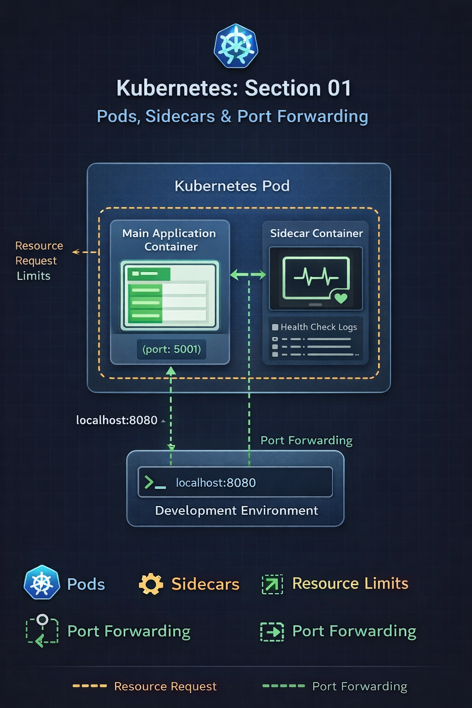
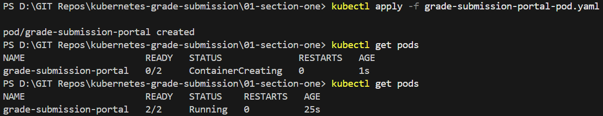
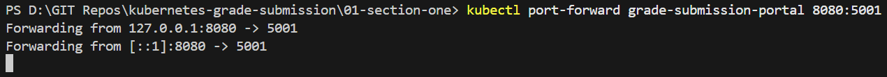
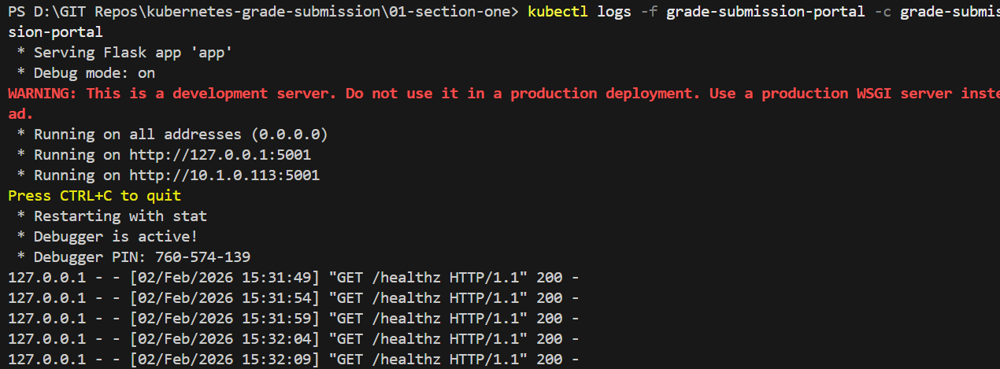
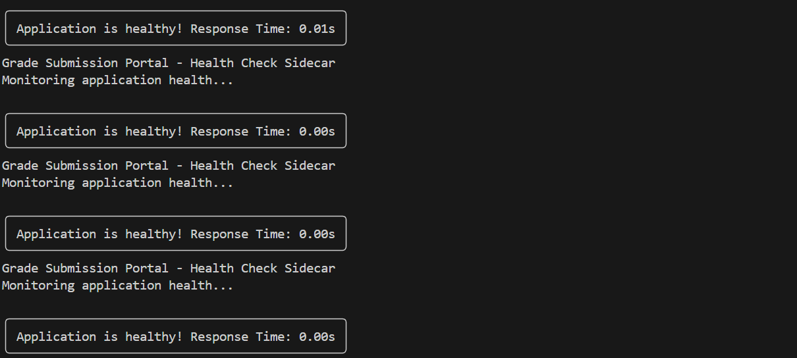
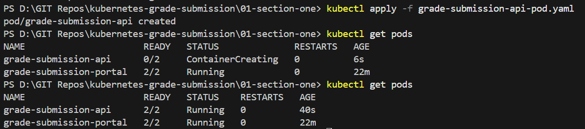
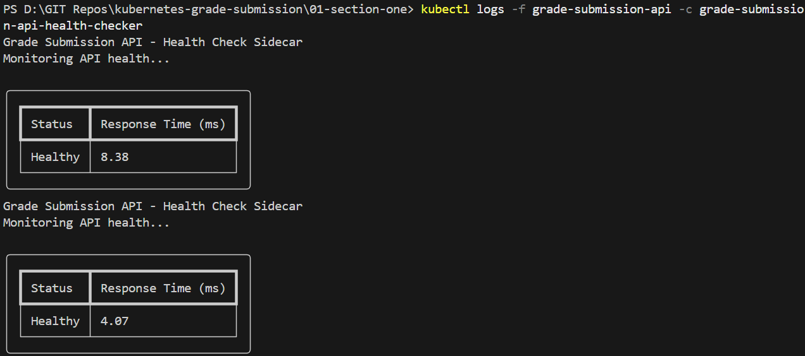
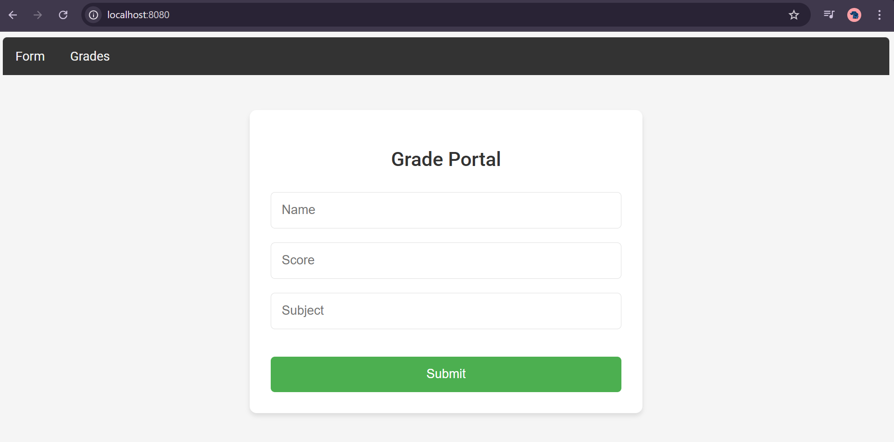

   # Repo Layout
   
    01-section-one-pods-and-sidecars/
    ├── grade-submission-portal-pod.yaml
    ├── grade-submission-api-pod.yaml
    ├── screenshots/
    │   ├── portal-ui.png
    │   ├── portal-pod-created.png
    │   ├── portal-pod-details.png
    │   ├── portal-port-forward.png
    │   ├── portal-container-logs.png
    │   ├── portal-health-checker-logs.png
    │   ├── api-pod-created.png
    │   ├── api-health-checker-logs.png
    │   ├── sectionone.png
    └── README.md


# Section 01 – Pods, Sidecars and Port Forwarding

## Overview
This section introduces the core Kubernetes building block: **Pods**, using a simple Grade Submission application.

The focus of this section is not UI changes, but understanding what Kubernetes does **behind the scenes**, including:
- Pod creation and lifecycle
- Multi-container Pods using the sidecar pattern
- Resource requests and limits
- Port forwarding for debugging and testing

---

## Application Architecture

The application consists of two Pods.

### Frontend Pod
- Main container: Grade Submission Portal
- Sidecar container: Health Checker
- Application port: `5001`

### Backend Pod
- Main container: Stateless Grade Submission API
- Sidecar container: Health Checker
- Application port: `3000`

All containers inside a Pod:
- Run on the same node
- Share the same IP address
- Communicate using `localhost`


---

## Frontend Pod

### Pod Creation

The frontend Pod is created using a Pod manifest containing two containers.

```bash
kubectl apply -f grade-submission-portal-pod.yaml
```



Pods created


Port Forwarding

Port forwarding is used to access the frontend application locally without creating a Service.
```
kubectl port-forward grade-submission-portal 8080:5001
```


Port forwarding active


Frontend application UI

Frontend Container Logs

Main application container logs
```
kubectl logs -f grade-submission-portal -c grade-submission-portal
```



Health checker sidecar container logs
```
kubectl logs -f grade-submission-portal -c grade-submission-portal-health-checker
```


Backend Pod Creation

The backend Pod is created with a stateless API container and a health-checker sidecar.
```
kubectl apply -f grade-submission-api-pod.yaml
```


Backend Health Checker Logs
```
kubectl logs -f grade-submission-api -c grade-submission-api-health-checker
```


# Kubernetes Concepts Demonstrated
## Pods

Pods are the smallest deployable units in Kubernetes

Kubernetes schedules Pods as a single atomic unit

Containers inside a Pod are always co-located

## Multi-Container Pods (Sidecar Pattern)

Sidecar containers run alongside the main application container

Sidecars add auxiliary functionality without modifying application code

Behind the scenes

Containers share the same network namespace

Communication happens via localhost

Common real-world sidecars include logging agents, monitoring exporters, and security tools

## Resource Requests and Limits

Each container defines CPU and memory requirements.

Behind the scenes

Scheduler uses resource requests to place Pods on nodes

Kubelet enforces resource limits using cgroups

Memory request and limit are set equal to prevent overcommit

CPU limits are defined for learning purposes

## Port Forwarding

Creates a temporary tunnel between the local machine and the Pod

Used for debugging and testing

Does not expose the application externally

No Service or Ingress is required

Commands Used
Frontend Pod
```
kubectl apply -f grade-submission-portal-pod.yaml
kubectl get pods
kubectl describe pod grade-submission-portal
kubectl logs -f grade-submission-portal -c grade-submission-portal
kubectl logs -f grade-submission-portal -c grade-submission-portal-health-checker
kubectl port-forward grade-submission-portal 8080:5001
```

Backend Pod
```
kubectl apply -f grade-submission-api-pod.yaml
kubectl get pods
kubectl logs -f grade-submission-api -c grade-submission-api-health-checker
```

Key Takeaways

Pods encapsulate one or more containers

Multi-container Pods enable the sidecar pattern

Resource requests influence scheduling decisions

Sidecars enhance applications without code changes

Port forwarding provides safe, temporary debugging access

Most Kubernetes behavior happens behind the scenes and is observed via CLI

## Frontend




