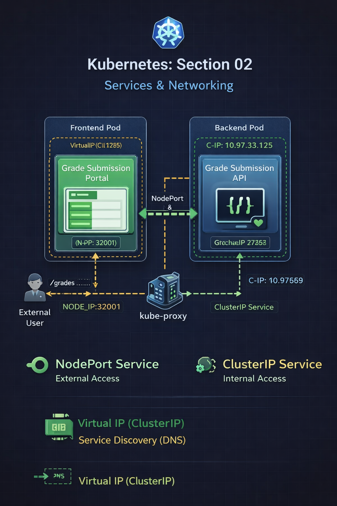
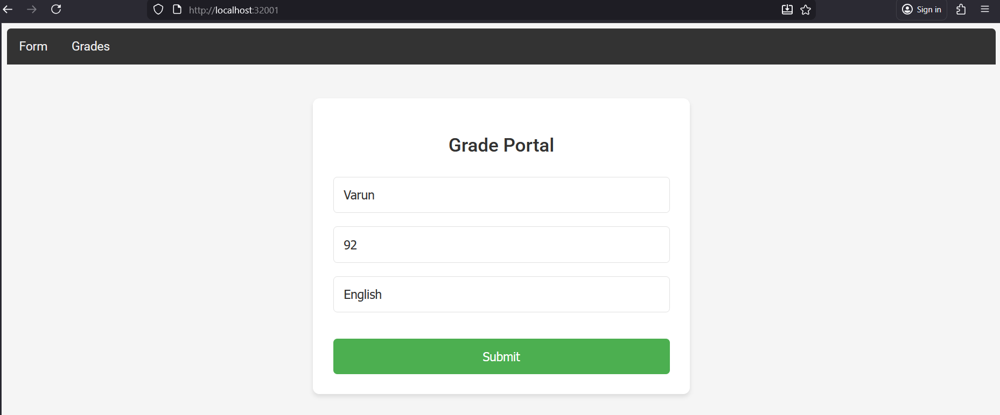
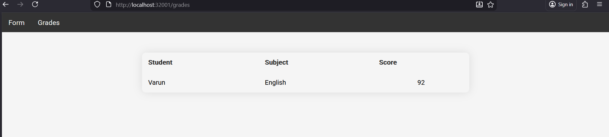
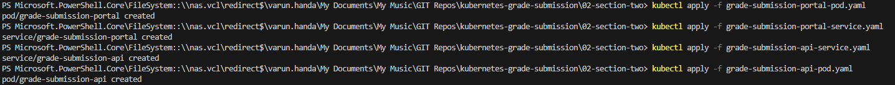
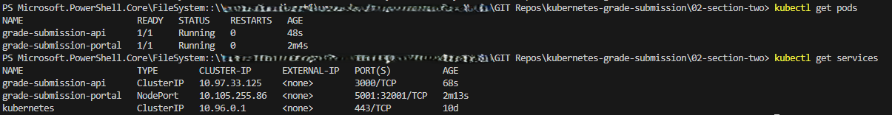

# Repo Layout
```
02-section-two-services-and-networking/
├── grade-submission-portal-pod.yaml
├── grade-submission-portal-service.yaml
├── grade-submission-api-pod.yaml
├── grade-submission-api-service.yaml
├── Screenshots/
│   ├── portal-ui-form.png
│   ├── portal-ui-grades.png
│   ├── pods-created.png
│   ├── pods-and-services.png
│   ├── sectiontwo.png
└── README.md
```
# Section 02 – Kubernetes Services (NodePort & ClusterIP)

## Overview
This section introduces **Kubernetes Services** and explains how they provide
**stable networking and service discovery** for Pods.

While Pods are ephemeral and their IPs can change, Services act as a **durable network abstraction**
that enables:
- External access to applications
- Reliable internal pod-to-pod communication

The frontend and backend applications remain unchanged.  
All networking behavior is handled by Kubernetes **behind the scenes**.

---

## Application Architecture

The application consists of:

### Frontend
- Pod: `grade-submission-portal`
- Service type: **NodePort**
- Exposed externally on a static node port

### Backend
- Pod: `grade-submission-api`
- Service type: **ClusterIP**
- Accessible only inside the cluster



---

## Frontend – NodePort Service

### Why NodePort
The frontend application needs to be accessed from outside the Kubernetes cluster.

A **NodePort Service** exposes the application on a static port of the node.

---

### Frontend Pod

```bash
kubectl apply -f grade-submission-portal-pod.yaml
```
The frontend Pod is configured with an environment variable:
```
env:
  - name: GRADE_SERVICE_HOST
    value: "grade-submission-api"
```
Behind the scenes

Kubernetes injects internal DNS resolution

The service name `grade-submission-api` resolves automatically to the backend Service IP

No hardcoded IP addresses are required

# Frontend Service (NodePort)
```
kubectl apply -f grade-submission-portal-service.yaml
```
```
type: NodePort
nodePort: 32001
```
Behind the scenes

Kubernetes opens port 32001 on the node

Traffic flow:

Request hits NODE_IP:32001

Service forwards traffic to its internal port (5001)

Service selects the correct Pod using labels

Traffic reaches the container port

# Frontend UI

Grade Submission Form



Grade Listing page



# Backend – ClusterIP Service
Why ClusterIP

The backend API should not be exposed externally.

A ClusterIP Service provides:

1. Internal-only access

2. Stable DNS-based service discovery

# Backend Pod
```
kubectl apply -f grade-submission-api-pod.yaml
```
# Backend Service (Cluster IP)
```
kubectl apply -f grade-submission-api-service.yaml
```
Behind the scenes

1. Kubernetes assigns a virtual IP (ClusterIP)

2. The service name becomes a DNS entry

3. Any Pod can access the backend using:
```
http://grade-submission-api:3000
```
4. Traffic is load-balanced automatically if multiple backend Pods exist

# Kubernetes Objects Created
```
kubectl get pods
kubectl get services
```
Pods Created

Pods and Services

# Kubernetes Concepts Demonstrated
Services
1. Services provide a stable endpoint for ephemeral Pods

2. They decouple networking from Pod lifecycle

# Node Port Service
1. Exposes applications externally using a static node port

2. Mostly used for:

    a. Development

    b. Prototyping

    c. Labs

Behind the scenes

1. kube-proxy programs routing rules

2. External traffic is forwarded to matching Pods via label selectors

# Cluster IP Service

1. Default Service type in Kubernetes

2. Used for internal communication only

Behind the scenes

1. DNS-based service discovery

2. Virtual IP routing handled by kube-proxy

3. Automatic load balancing across Pods

## Commands Used
```
kubectl apply -f grade-submission-portal-pod.yaml
kubectl apply -f grade-submission-portal-service.yaml
kubectl apply -f grade-submission-api-service.yaml
kubectl apply -f grade-submission-api-pod.yaml
```

```
kubectl get pods
kubectl get services
```


# Key Takeaways

1. Pods are ephemeral, Services are stable

2. NodePort enables external access to cluster workloads

3. ClusterIP enables secure internal communication

4. Services use label selectors to route traffic

5. DNS-based service discovery removes the need for hardcoded IPs

6. Kubernetes handles networking transparently behind the scenes