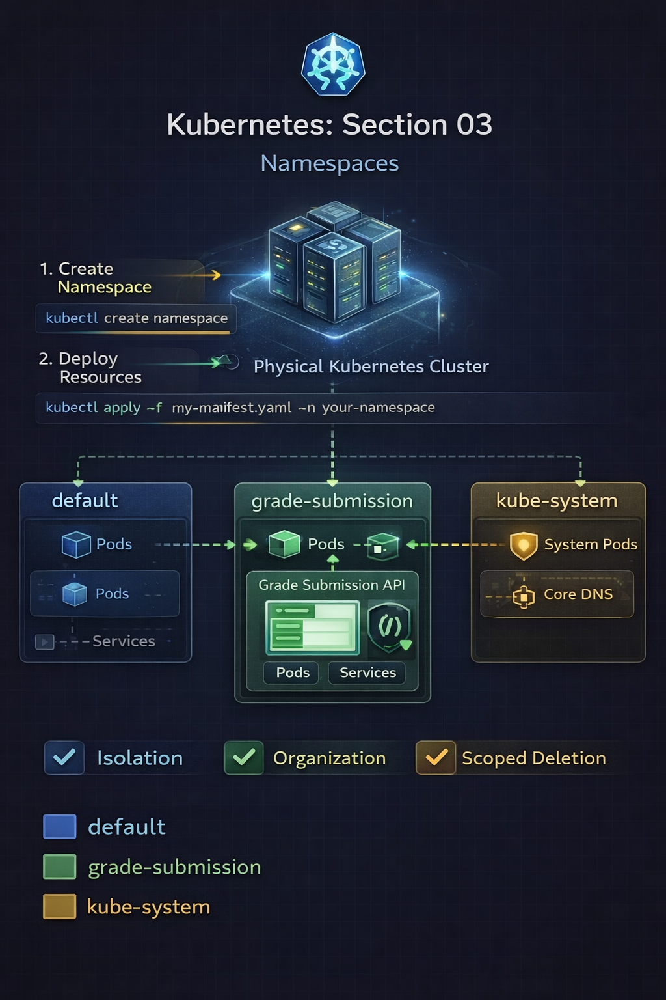
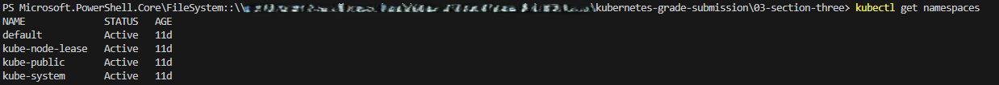
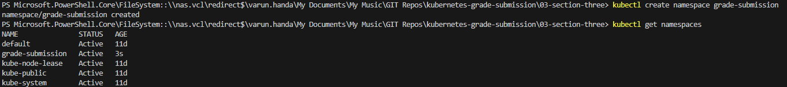
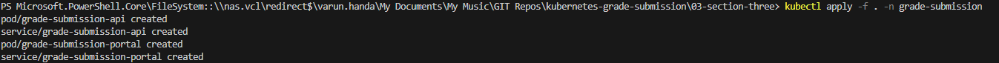
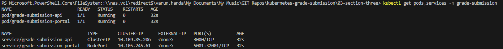
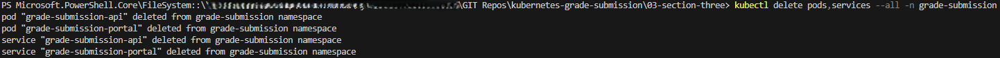
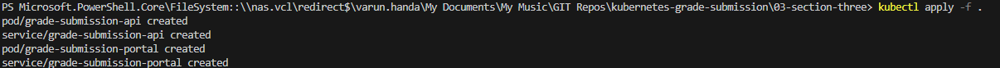
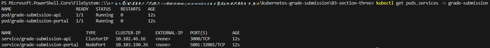

# Repo Layout
```
03-section-three-namespaces/
├── grade-submission-api-pod.yaml
├── grade-submission-api-service.yaml
├── grade-submission-portal-pod.yaml
├── grade-submission-portal-service.yaml
├── screenshots/
│   ├── namespaces-created.png
│   ├── default-namespace.png
│   ├── apply-with-namespace-flag.png
│   ├── pods-services-under-namespace.png
│   ├── delete-resources-namespace.png
│   ├── recreate-resources-with-namespace.png
│   ├── final-state-namespace.png
│   ├── sectionthree.png
└── README.md
```
# Section 03 – Kubernetes Namespaces

## Overview
As Kubernetes clusters grow, running everything in a single shared space becomes difficult to manage and reason about.

This section introduces **Namespaces**, which provide logical isolation inside a Kubernetes cluster.  
While the cluster is physically shared, namespaces allow workloads to be **grouped, isolated, and managed independently**.

The application itself remains unchanged.  
Only the **scope and placement of resources** changes.

---



## Why Namespaces Matter

Without namespaces:
- All Pods and Services exist in the same logical space
- Naming conflicts become likely
- Resource isolation is difficult
- Operational mistakes impact unrelated workloads

Namespaces solve this by acting as **logical partitions** inside the cluster.

---

## Step 1 – Inspect Existing Namespaces

```bash
kubectl get namespaces
```

### Default namespaces present


### Behind the scenes

* Kubernetes always runs system components in reserved namespaces:

    - kube-system

    - kube-public

    - kube-node-lease

* User workloads normally live in the `default` namespace unless specified

## Step 2 – Creating a dedicated namespace
```
kubectl create namespace grade-submission
```
### Namespace created
```
kubectl get namespaces
```


### Behind the scenes

* A namespace is a logical construct stored in etcd
* It does not create new nodes or networks
* It scopes visibility and access to Kubernetes resources

## Step 3 – Deploying Resources using Namespace Flag
Initially, resources were deployed using the -n flag:
```
kubectl apply -f . -n grade-submission
```

```
kubectl get pods,services -n grade-submission
```


### Behind the scenes

* Kubernetes associates each resource with the specified namespace
* Resources in one namespace are invisible to others unless explicitly referenced

## Step 4 – Adding Namespace to YAML Manifests

To make deployments self-contained and repeatable, the namespace was added directly to all manifests.

Example:
```
metadata:
  name: grade-submission-api
  namespace: grade-submission
```
This removes the need to rely on CLI flags.

## Step 4 – Clean Up and Recreate Resources

Existing resources were deleted:
```
kubectl delete pods,services --all -n grade-submission
```


Resources were then recreated using plain apply:
```
kubectl apply -f .
```

```
kubectl get pods,services -n grade-submission
```


### Behind the scenes

* Namespace declaration in YAML guarantees correct placement

* Eliminates accidental deployment into the default namespace

* Improves safety and predictability

## Kubernetes Concepts Demonstrated

### Namespaces

* Logical partitions within a cluster

* Scope resource names and visibility

* Commonly used for:

    * Environment separation (dev / test / prod)

    * Team isolation

    * Policy and quota enforcement

 ### Default Namespace Behavior

 * If no namespace is specified:
     * Resorces are placed in `default`

* This can lead to:
     * Resources collisions
     * Operational mistakes

 ### Best Practices

* Always be aware of the active namespace

* Prefer namespace declaration inside YAML for production

* Use namespaces as the first layer of isolation

### Commands Used
```
kubectl get namespaces
kubectl create namespace grade-submission
kubectl apply -f . -n grade-submission
kubectl get pods,services -n grade-submission
kubectl delete pods,services --all -n grade-submission
kubectl apply -f .
kubectl get pods,services -n grade-submission
```

## Key Takeaways

* Kubernetes clusters are shared but logically partitioned

* Namespaces provide isolation without additional infrastructure

* Namespace awareness is critical to safe operations

* Declaring namespaces in YAML improves reproducibility

* Namespaces are foundational for multi-team and multi-environment clusters


---


