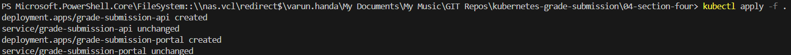
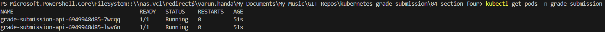
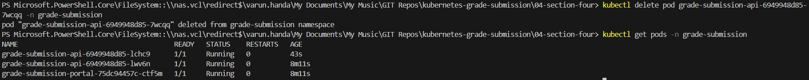

# Repo Layout
```
04-section-four-deployments-and-self-healing/
├── grade-submission-api-deployment.yaml
├── grade-submission-api-service.yaml
├── grade-submission-portal-deployment.yaml
├── grade-submission-portal-service.yaml
├── Screenshots/
│   ├── kubectl-apply.png
│   ├── kubectl-get-deployments.png
│   ├── kubectl-get-pods.png
│   ├── kubectl-pods-deletion-and-auto-creation.png
├   ├── section-four.png
└── README.md
```

# Section 04 – Deployments, ReplicaSets & Self-Healing

## Overview
Running Pods directly works, but it does not provide resilience.  
If a Pod crashes, it must be recreated manually.

This section introduces **Deployments**, which allow Kubernetes to:
- Maintain a desired number of Pods
- Automatically replace failed Pods
- Manage application lifecycle declaratively

The application code remains unchanged.  
Only the **control mechanism** changes.

---

## From Pods to Deployments

In earlier sections, Pods were created directly.  
In this section:
- Pod manifests were replaced with **Deployment manifests**
- Desired replica counts were declared
- Kubernetes took responsibility for Pod lifecycle management

---

## Application Architecture

### Backend
- Resource type: **Deployment**
- Replicas: `2`
- Service type: **ClusterIP**

### Frontend
- Resource type: **Deployment**
- Replicas: `1`
- Service type: **NodePort**

All resources run inside the `grade-submission` namespace.

---

## Step 1 – Apply Deployment Manifests


```bash
kubectl apply -f .
```



### Behind the Scenes

* Kubernetes stores the Deployment specification in etcd

* The Deployment Controller is notified of a new desired state

## Step 2 – Inspect Deployments
```
kubectl get deployments -n grade-submission
```
### Behind the Scenes

* The Deployment Controller creates a ReplicaSet

* The ReplicaSet represents the exact replica requirements

* Availability and readiness are tracked continuously

## Step 2 – Observe Created Pods 
```
kubectl get pods -n grade-submission
```
### Pods created by ReplicaSet


### Behind the Scenes

* The ReplicaSet Controller creates Pods to match the desired replica count

* Pod names include a hash derived from the pod template

* Pods are not owned directly by the Deployment, but by the ReplicaSet


## Step 4 – Trigger Self-Healing

To test self-healing, one backend Pod was deleted manually:
```
kubectl delete pod grade-submission-api-6949948d85-7wcqq -n grade-submission
```
```
kubectl get pods -n grade-submission
```

### Pod deleted and recreated automatically



### Behind the Scenes

* ReplicaSet Controller detects fewer running Pods than desired

* A new Pod is created immediately

* No manual intervention is required

* The desired state is restored automatically

## Kubernetes Controllers Involved
### Deployment Controller

* Manages the overall application lifecycle

* Creates and updates ReplicaSets

* Handles rollout and rollback strategies

### ReplicaSet Controller

* Ensures the desired number of Pods are always running

* Watches Pod state continuously

* Recreates Pods on failure

### Scheduler & Kubelet

* Scheduler assigns Pods to nodes

* Kubelet ensures containers are running as specified