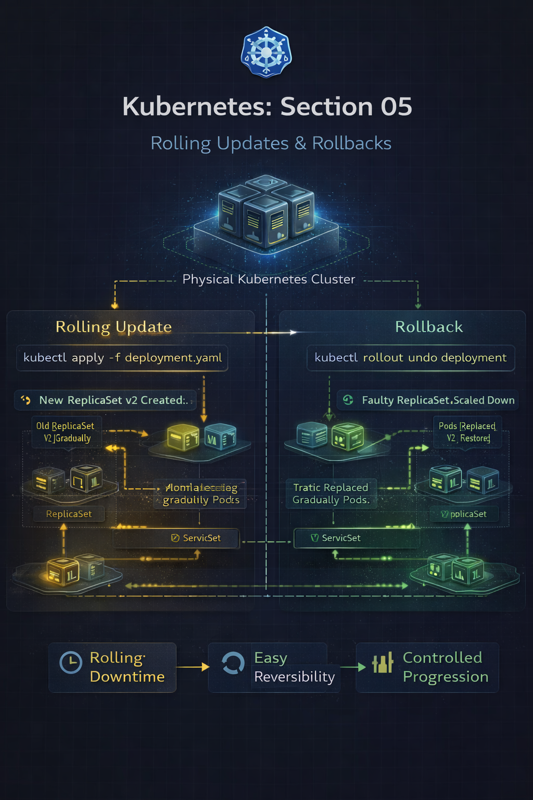
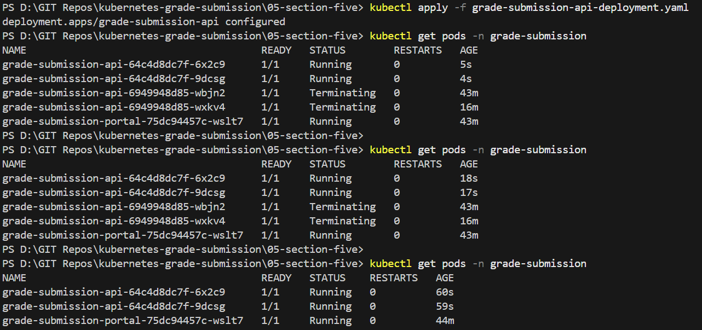
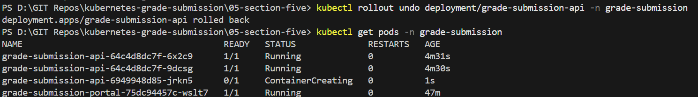
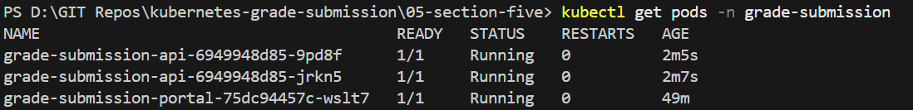
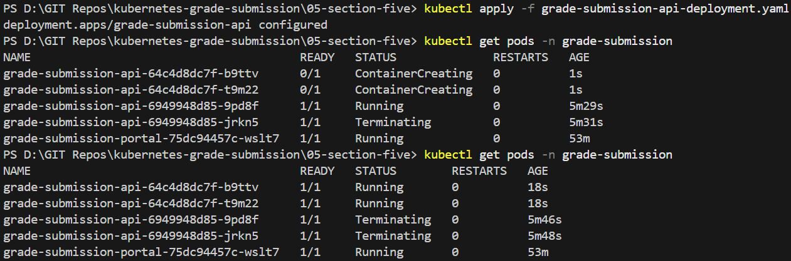

# Repo Layout
```
05-section-five-rolling-updates-and-rollbacks
├── grade-submission-api-deployment.yaml
├── grade-submission-api-service.yaml
├── grade-submission-portal-deployment.yaml
├── grade-submission-portal-service.yaml
├── Screenshots/
│   ├── kubectl-grade-submission-api-deployment-rollback-successful.png
│   ├── kubectl-grade-submission-api-deployment-rollback.png
│   ├── kubectl-grade-submission-api-deployment-stateful-with-strategy.png
│   ├── kubectl-grade-submission-api-deployment-stateful.png
│   ├── section-five.png
└── README.md
```

# Section 05 – Rolling Updates & Rollbacks

## Overview
Upgrading applications in production is risky if not handled carefully.

If all running Pods are terminated at once during an update, the result is **downtime**.
Kubernetes solves this problem using **rolling updates** and **rollbacks**, managed automatically by the Deployment controller.

In this section, application updates were intentionally broken and then safely recovered to observe Kubernetes behavior.

---

## What changed in this section

- Modified the backend Deployment to use a different container image
- Observed application failure after the update
- Rolled back the Deployment to a previous working version
- Added a custom rolling update strategy
- Observed controlled Pod replacement during updates

---

## Application Architecture



---

## Step 1 - Introducing a Breaking Change
```bash
rslim087/kubernetes-course-grade-submission-api:stateless
```
to: 
```
rslim087/kubernetes-course-grade-submission-api:stateful
```
```
kubectl apply -f grade-submission-api-deployment.yaml
```



Deployment is now updated

## Observed Behavior

- Frontend stopped responding

- Backend Pods were running, but application behavior was incorrect

## Behind the Scenes

- Kubernetes successfully rolled out the new Pods

- The platform had no knowledge that the application logic was broken

- From Kubernetes’ perspective, the desired state was satisfied


## Step 2 - Roll Back the Deployment

To recover, the Deployment was rolled back:

```
kubectl rollout undo deployment/grade-submission-api -n grade-submission
```
Rollback initiated



Rollback successful


### Behind the Scenes

- Kubernetes retained the previous ReplicaSet

- The faulty ReplicaSet was scaled down

- A new ReplicaSet using the previous image was scaled up

- Pods were replaced gradually using a rolling strategy

## Step 3 - Observe Pod Transitions

```
kubectl get pods -n grade-submission
```


During the rollback and updates:

- Old Pods entered `Terminating` state

- New Pods entered `ContainerCreating` and then `Running`

- Service traffic was continuously routed to healthy Pods

### Behind the Scenes

- Two ReplicaSets briefly coexisted

- The Service continued routing traffic using labels

- At no point were all Pods unavailable


## Step 4 - Configure Rolling Update Strategy

A rolling update strategy was added to the Deployment:
```
strategy:
  type: RollingUpdate
  rollingUpdate:
    maxUnavailable: 50%
    maxSurge: 1
```

Meaning of these values

- `maxUnavailable: 50%`

    At least one Pod must always remain available

- `maxSurge: 1`

    Allows one extra Pod above the desired replica count

## Step 5 - Observe Controlled Rolling Update

After applying the strategy and reapplying the Deployment:
```
kubectl apply -f grade-submission-api-deployment.yaml
```

Rolling update without strategy


Rolling update with strategy




### Behind the Scenes

- Kubernetes created a new ReplicaSet for the updated template

- Old Pods were terminated gradually

- New Pods were created within defined limits

- Availability was preserved throughout the process


### How Rolling Updates Work Internally

- Deployment template changes

- A new ReplicaSet is created

- Old ReplicaSet is scaled down gradually

- New ReplicaSet is scaled up gradually

- Traffic is always routed to available Pods


### Rollbacks Explained
When a rollback is triggered:

- Kubernetes does not “rewind” Pods

- It creates a new ReplicaSet using the previous configuration

- The same rolling strategy is used during rollback

This ensures:

- Minimal downtime

- Safe recovery from faulty releases

### Commands Used
```
kubectl apply -f grade-submission-api-deployment.yaml
kubectl get pods -n grade-submission
kubectl rollout undo deployment/grade-submission-api -n grade-submission
kubectl get pods -n grade-submission
kubectl apply -f grade-submission-api-deployment.yaml
kubectl get pods -n grade-submission
```

# Key Takeways

- Rolling updates prevent downtime during upgrades

- Deployments manage multiple ReplicaSets automatically

- Rollbacks are first-class citizens in Kubernetes

- maxUnavailable and maxSurge control update safety

- Kubernetes enforces availability, not application correctness

- Safe releases require both platform guarantees and application validation

# Why this section is a big deal

This section proves you understand:

- Zero-downtime deployments
- Failure recovery in production
- Declarative state transitions
- Controller-driven orchestration