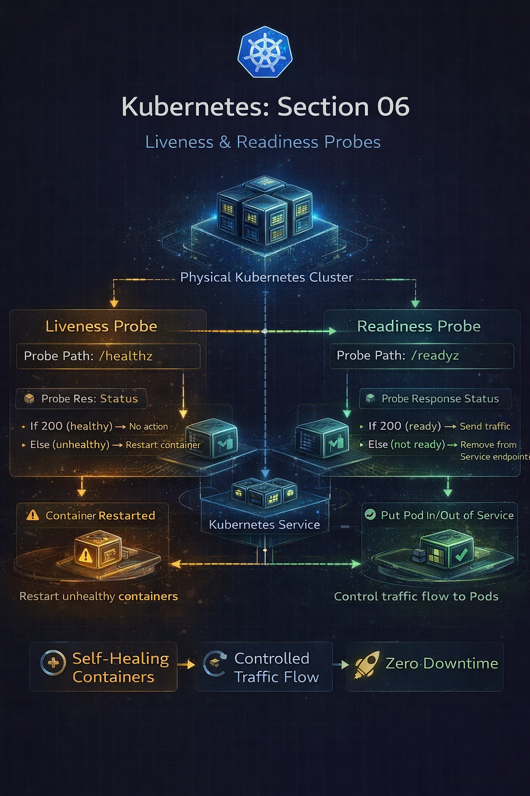
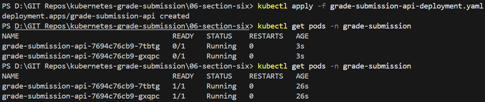
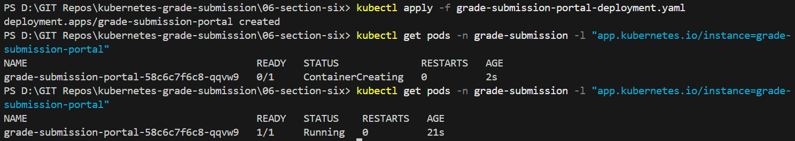

# Repo Layout
```
06-section-six-health-probes
├── grade-submission-api-deployment.yaml
├── grade-submission-api-service.yaml
├── grade-submission-portal-deployment.yaml
├── grade-submission-portal-service.yaml
├── Screenshots/
│   ├── kubectl-grade-submission-api-deployment.png
│   ├── kubectl-grade-submission-portal-deployment.png
│   ├── section-six.png
└── README.md
```
# Section 06 – Liveness & Readiness Probes

## Overview

Running containers is not enough in production.
Applications must be **healthy**, **ready**, and **recoverable**.

In this section, liveness and readiness probes were added to both backend and frontend Deployments to allow Kubernetes to:

- Automatically restart unhealthy containers
- Control when Pods are allowed to receive traffic
- Prevent broken Pods from impacting users

---

## What Changed in This Section

- Restored backend image to a stable version (`stateless`)
- Added **liveness probes** to detect unhealthy containers
- Added **readiness probes** to control traffic flow
- Observed Pod lifecycle during startup and health checks

---




## Backend Deployment – Health Probes

### Liveness Probe (Backend)

```yaml
livenessProbe:
  httpGet:
    path: /healthz
    port: 3000
  initialDelaySeconds: 15
  periodSeconds: 5
```
Purpose

- Detects if the application process is alive

- If `/healthz` returns non-200 or times out, Kubernetes restarts the container

### Readiness Probe (Backend)
```
readinessProbe:
  httpGet:
    path: /readyz
    port: 3000
  initialDelaySeconds: 10
  periodSeconds: 5
```
Purpose

- Determines whether the application is ready to serve traffic

- Until this probe passes, the Pod is excluded from Service endpoints

## Backend Deployment Applied
```
kubectl apply -f grade-submission-api-deployment.yaml
```

## Frontend Deployment - Health probes
### Liveness Probe (Frontend)
```
livenessProbe:
  httpGet:
    path: /healthz
    port: 5001
  initialDelaySeconds: 15
  periodSeconds: 5
```
### Readiness Probe (Frontend)
```
readinessProbe:
  httpGet:
    path: /readyz
    port: 5001
  periodSeconds: 5
```
Key Difference

- Readiness does not require an initial delay

- During startup, returning “not ready” is expected and correct behavior

## Frontend Deployment Applied

```
kubectl apply -f grade-submission-portal-deployment.yaml
```

# Observing Pod Startup Behavior

```
kubectl get pods -n grade-submission
```


During startup:

- Pods initially show 0/1 Ready

- Containers start successfully

- Readiness probe passes

- Pods transition to 1/1 Ready

- Services begin routing traffic


## Behind the Scenes – How Kubernetes Uses Probes

### Liveness Probe

- Executed by the kubelet

- Failure triggers container restart

- Pod remains the same, container is recreated

- Used to recover from deadlocks or crashes

### Readiness Probe

- Evaluated continuously

- Controls whether a Pod appears in Service endpoints

- Failing readiness does not restart the container

- Used to protect users from partially initialized applications


## Why Initial Delay Matters

Applications need startup time.

If probes run too early:

- Containers may be restarted unnecessarily

- Pods may flap between Ready and NotReady

Correct configuration ensures:

- Liveness checks start only after initialization

- Readiness accurately reflects real availability

## Commands Used 
```
kubectl apply -f grade-submission-api-deployment.yaml
kubectl apply -f grade-submission-portal-deployment.yaml
kubectl get pods -n grade-submission
```

## Key Takeaways

- Liveness probes detect broken containers

- Readiness probes control traffic flow

- Kubernetes separates process health from service availability

- Self-healing happens automatically, without human intervention

- Probes are essential for zero-downtime deployments

This section transforms Kubernetes from a scheduler into a self-healing system.

