# Repo Layout
```
07-section-six-statefulsets-and-storage
├── grade-submission-api-deployment.yaml
├── grade-submission-api-service.yaml
├── grade-submission-portal-deployment.yaml
├── grade-submission-portal-service.yaml
├── mongodb-statefulset.yaml
├── mongodb-service.yaml
├── Screenshots/
│   ├── section-seven.png
│   ├── mongodb-stateful-apply.png
│   ├── mongodb-service-apply.png
│   ├── kubectl-apply-all
│   ├── mongodb-stateful-reapply.png
│   ├── authentication-failed.png
│   ├── localhost-1.png
│   ├── kubectl-reapply-all.png
│   ├── localhost-2.png
│   ├── localhost-3.png
│   ├── localhost-4.png
│   ├── section-seven.png
└── README.md
```
# Section 07 - Statefulsets, Persistent Storage and Database Authentication

## Overview

Stateless workloads are easy to scale and replace.
Databases are not.

In this section, a MongoDB database was introduced using **StatefulSets** and **Persistent Volume Claims (PVCs)** to ensure:

- Stable pod identity
- Persistent data across pod restarts
- Safe scaling behavior
- Reliable database connectivity
- Authentication enforcement

This section demonstrates how Kubernetes manages **stateful workloads and storage orchestration**.

---

## Application Architecture

**Components**
- **Frontend (Grade Submission Portal)**
  - Exposed externally using a NodePort Service
- **Backend (Grade Submission API)**
  - Communicates internally with MongoDB
- **Database (MongoDB)**
  - Deployed using a StatefulSet
  - Uses persistent storage via PVCs

**Traffic Flow**
1. User accesses frontend via NodePort
2. Frontend calls backend using Service DNS
3. Backend connects to MongoDB using Service DNS
4. MongoDB stores data on persistent volumes

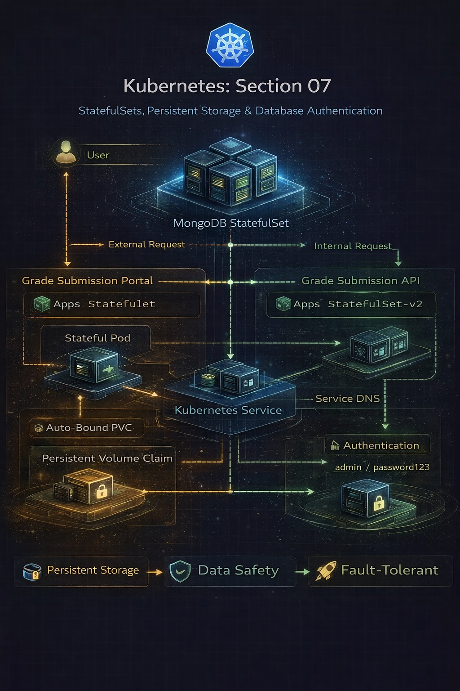

---

## Step 1 – Deploy MongoDB Using a StatefulSet

A MongoDB StatefulSet was created with:
- Stable pod naming (`mongodb-0`, `mongodb-1`)
- Per-pod persistent storage
- VolumeClaimTemplates for automatic PVC creation

```bash
kubectl apply -f mongodb-statefulset.yaml
kubectl get statefulset -n grade-submission
kubectl get pvc -n grade-submission
```
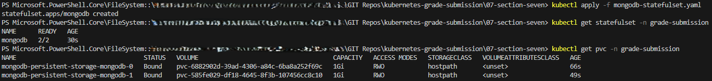


## Behind the Scenes – Why StatefulSets?

Unlike Deployments:

- Pod names are stable

- Pod identity is preserved

- Each pod gets its own PVC

- Storage follows the pod lifecycle

Kubernetes guarantees:

- mongodb-0 always reattaches to the same volume

- Data survives pod restarts and rescheduling

---

## Step 2 – Expose MongoDB Internally

A ClusterIP Service was created for MongoDB:
```
kubectl apply -f mongodb-service.yaml
```
This allows backend pods to connect using:
```
mongodb:27017
```
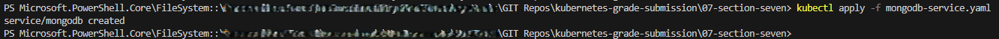

---

## Step 3 – Connect Backend to MongoDB

The backend Deployment was updated to:

- Use a new application version

- Pass MongoDB connection details via environment variables
```
env:
  - name: MONGODB_HOST
    value: mongodb
  - name: MONGODB_PORT
    value: "27017"
```

```
kubectl apply -f .
```
```
kubectl logs -f <api-pod> -n grade-submission
```

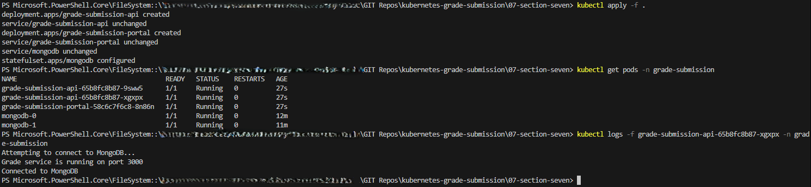

---

## Step 4 – Scaling Down the StatefulSet

The MongoDB StatefulSet replica count was reduced:

```
replicas: 1
```
```
kubectl apply -f mongodb-statefulset.yaml
kubectl get pods -n grade-submission
```
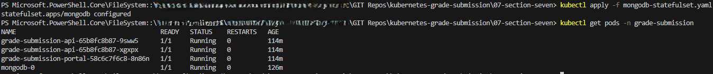

## Observation

- mongodb-1 terminated

- mongodb-0 remained intact

- Data consistency improved

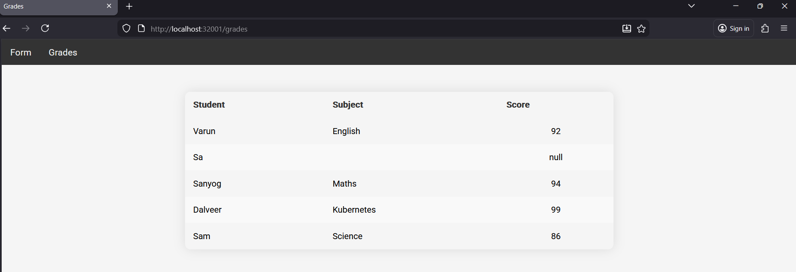

---

Step 5 – Verify Data Persistence
All pods were deleted:
```
kubectl delete pod --all -n grade-submission
kubectl get pods -n grade-submission
```

## After recreation:

- Application data persisted

- MongoDB reused the same PVC

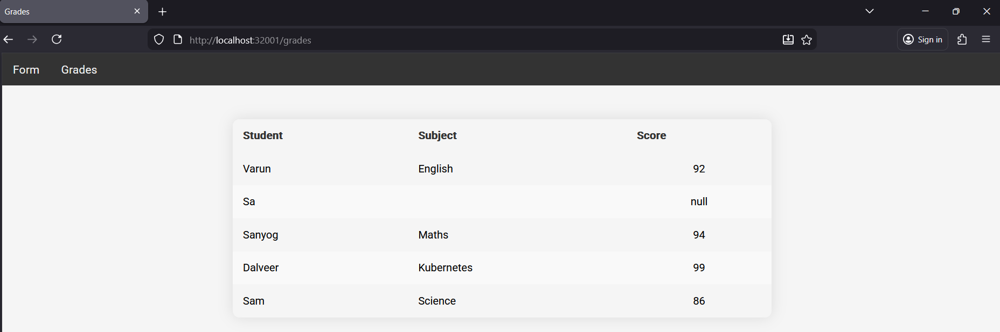

---

## Step 6 – Add MongoDB Authentication
MongoDB StatefulSet was updated with credentials:
```
env:
  - name: MONGO_INITDB_ROOT_USERNAME
    value: admin
  - name: MONGO_INITDB_ROOT_PASSWORD
    value: password123
```
Backend Deployment was updated with credentials.

A wrong password was intentionally used to verify failure behavior.

```
kubectl logs -f <api-pod> -n grade-submission
```
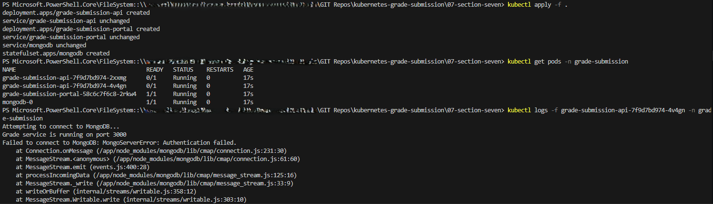

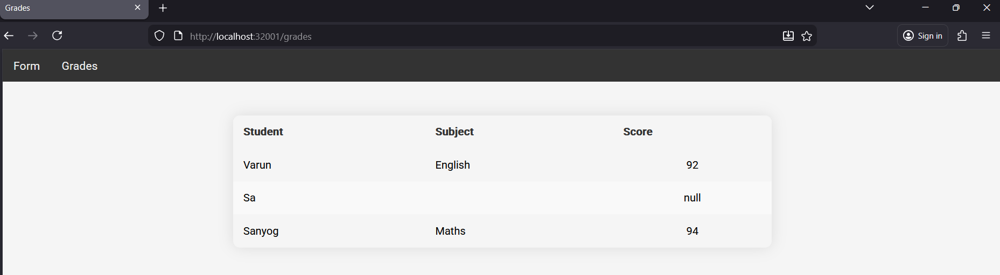

## Step 7 – Fix Credentials and Verify Recovery

Password was corrected and reapplied:
```
kubectl apply -f .
kubectl get pods -n grade-submission
```
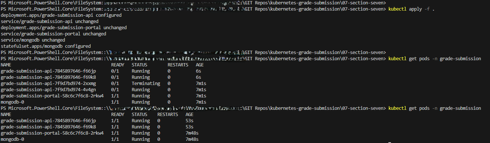

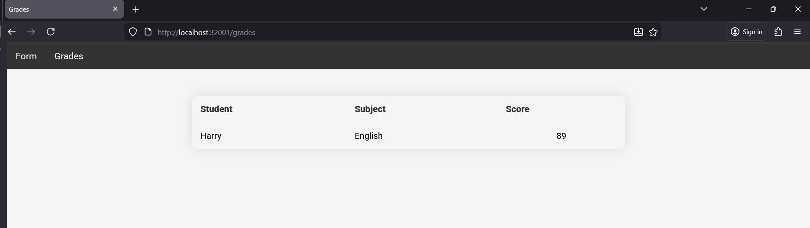

# Behind the Scenes – Storage Orchestration

Kubernetes automatically handled:

- PVC creation per StatefulSet pod

- Binding PVCs to PVs

- Reattaching volumes on pod recreation

- Maintaining pod identity and data integrity

Developers declare intent.
Kubernetes enforces state.

Commands used: 

```
kubectl apply -f mongodb-statefulset.yaml
kubectl apply -f mongodb-service.yaml
kubectl apply -f .
kubectl get pods -n grade-submission
kubectl get pvc -n grade-submission
kubectl delete pod --all -n grade-submission
kubectl logs -f <api-pod> -n grade-submission
```
Key Takeaways

- StatefulSets are designed for databases and stateful apps

- PVCs ensure data persistence across pod restarts

- Storage orchestration is handled by Kubernetes

- Pod identity and volume attachment are guaranteed

- Authentication failures are observable and recoverable

- Kubernetes safely manages state, not just containers

This section demonstrates production-grade stateful workload management.

---

This section proves you understand:

- Stateful vs stateless workloads
- Storage orchestration
- Data durability
- Failure testing
- Real database behavior in Kubernetes


