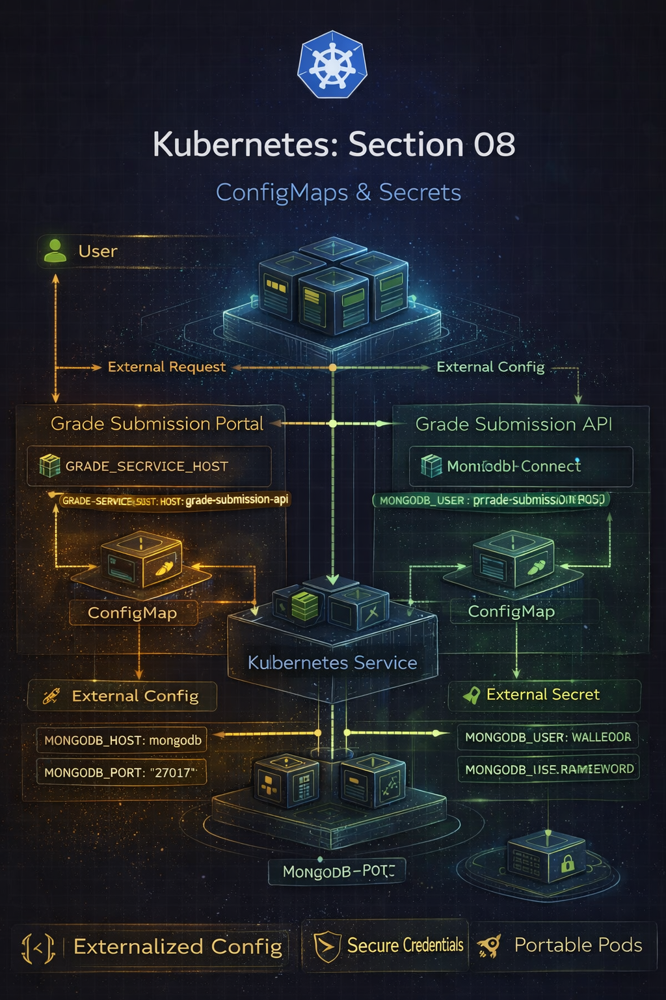
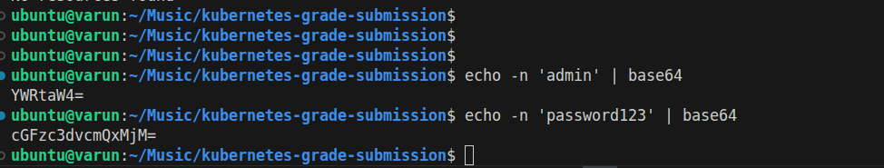
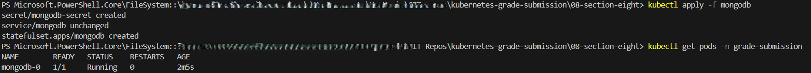
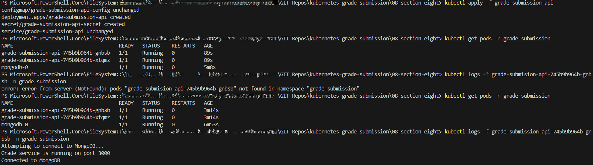
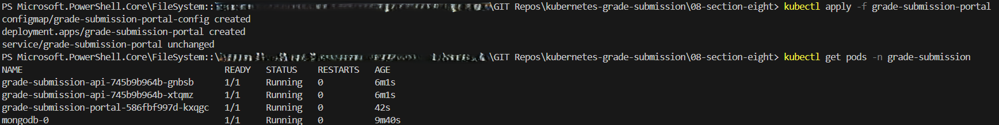

# Repo Layout
```
08-section-eight-Config Maps and Secrets

├── grade-submission-api/
│   ├── grade-submission-api-config.yaml
│   ├── grade-submission-api-secret.yaml
│   ├── grade-submission-api-deployment.yaml
│   └── grade-submission-api-service.yaml
│
├── grade-submission-portal/
│   ├── grade-submission-portal-config.yaml
│   ├── grade-submission-portal-deployment.yaml
│   └── grade-submission-portal-service.yaml
│
├── mongodb/
│   ├── mongodb-secret.yaml
│   ├── mongodb-statefulset.yaml
│   └── mongodb-service.yaml
│
├── Screenshots
│   ├── mongodb-secret.yaml
│   ├── mongodb-statefulset.yaml
│   └── mongodb-service.yaml
│
└── README.md
```


# Section 07 - ConfigMaps & Secrets (Decoupling Configuration from Code)

## Overview
This section focuses on externalizing configuration and secrets from application manifests using ConfigMaps and Secrets, following Kubernetes best practices for security, portability, and maintainability.

By the end of this section:

- Application code remains unchanged

- Configuration can be updated independently

- Sensitive values are not hardcoded in manifests

- Workloads are environment-agnostic

---

## Application Architecture


```
External User
     |
     |  NodePort :32001
     v
Grade Submission Portal (Deployment)
     |
     |  Service (ClusterIP)
     v
Grade Submission API (Deployment)
     |
     |  Service (ClusterIP)
     v
MongoDB (StatefulSet + PVC)

```
### Configuration Flow

## Frontend

- Reads backend hostname from ConfigMap

## Backend

- Reads DB host/port from ConfigMap

- Reads DB credentials from Secret

## Database

- Reads root credentials from Secret

- Persists data using PVC




### What Changed in This Section

## 1️⃣ Environment Variables Removed from Deployments

- No more hardcoded `env:` blocks

- All configuration moved to:

  - ConfigMaps → non-sensitive data

  - Secrets → credentials


## 2️⃣ ConfigMaps Introduced

Backend ConfigMap
```
kind: ConfigMap
data:
  MONGODB_HOST: mongodb
  MONGODB_PORT: "27017"
```

Frontend ConfigMap
```
kind: ConfigMap
data:
  GRADE_SERVICE_HOST: grade-submission-api
```

## 3️⃣ Secrets Introduced (Base64 Encoded)
```
echo -n 'admin' | base64
echo -n 'password123' | base64
```
```
kind: Secret
type: Opaque
data:
  MONGODB_USER: YWRtaW4=
  MONGODB_PASSWORD: cGFzc3dvcmQxMjM=
```


## 4️⃣ envFrom Used in Pods
```
envFrom:
  - configMapRef:
      name: grade-submission-api-config
  - secretRef:
      name: grade-submission-api-secret
```
This keeps:

- YAML clean

- Configuration reusable

- Secrets invisible in pod specs

## ▶️ Deployment Order (Important)

```
kubectl apply -f mongodb/
kubectl apply -f grade-submission-api/
kubectl apply -f grade-submission-portal/
```


## 🔍 Verification

```
kubectl get pods -n grade-submission
kubectl logs -f <api-pod> -n grade-submission
```

Expected Logs:
```
Attempting to connect to MongoDB...
Connected to MongoDB
```




# 🧠 Behind the Scenes (What Kubernetes Does)

ConfigMaps

- Inject values as environment variables at runtime

- Allow config changes without rebuilding images

- Enable environment-specific overrides


Secrets

- Stored separately from application code

- Base64 encoded (⚠️ not encrypted)

- Mounted securely into pods

Why This Matters

- Clean separation of code vs configuration

- Safer credential handling

- Easier CI/CD and environment promotion

- Production-aligned Kubernetes design

⚠️ Security Note

Kubernetes Secrets are not encrypted by default.

In real environments:

- Enable encryption at rest

- Use external secret managers (Vault, AWS Secrets Manager, etc.)

- Restrict RBAC access to Secrets

✅ Key Takeaways

- ConfigMaps handle configuration

- Secrets handle credentials

- Deployments should never contain secrets directly

- Kubernetes encourages declarative, portable, secure design


## Step 1 – Deploy MongoDB Using a StatefulSet

A MongoDB StatefulSet was created with:
- Stable pod naming (`mongodb-0`, `mongodb-1`)
- Per-pod persistent storage
- VolumeClaimTemplates for automatic PVC creation

```bash
kubectl apply -f mongodb-statefulset.yaml
kubectl get statefulset -n grade-submission
kubectl get pvc -n grade-submission
```


## Behind the Scenes – Why StatefulSets?

Unlike Deployments:

- Pod names are stable

- Pod identity is preserved

- Each pod gets its own PVC

- Storage follows the pod lifecycle

Kubernetes guarantees:

- mongodb-0 always reattaches to the same volume

- Data survives pod restarts and rescheduling

---

## Step 2 – Expose MongoDB Internally

A ClusterIP Service was created for MongoDB:
```
kubectl apply -f mongodb-service.yaml
```
This allows backend pods to connect using:
```
mongodb:27017
```


---

## Step 3 – Connect Backend to MongoDB

The backend Deployment was updated to:

- Use a new application version

- Pass MongoDB connection details via environment variables
```
env:
  - name: MONGODB_HOST
    value: mongodb
  - name: MONGODB_PORT
    value: "27017"
```

```
kubectl apply -f .
```
```
kubectl logs -f <api-pod> -n grade-submission
```


---

## Step 4 – Scaling Down the StatefulSet

The MongoDB StatefulSet replica count was reduced:

```
replicas: 1
```
```
kubectl apply -f mongodb-statefulset.yaml
kubectl get pods -n grade-submission
```


## Observation

- mongodb-1 terminated

- mongodb-0 remained intact

- Data consistency improved


---

Step 5 – Verify Data Persistence
All pods were deleted:
```
kubectl delete pod --all -n grade-submission
kubectl get pods -n grade-submission
```

## After recreation:

- Application data persisted

- MongoDB reused the same PVC


---

## Step 6 – Add MongoDB Authentication
MongoDB StatefulSet was updated with credentials:
```
env:
  - name: MONGO_INITDB_ROOT_USERNAME
    value: admin
  - name: MONGO_INITDB_ROOT_PASSWORD
    value: password123
```
Backend Deployment was updated with credentials.

A wrong password was intentionally used to verify failure behavior.

```
kubectl logs -f <api-pod> -n grade-submission
```


## Step 7 – Fix Credentials and Verify Recovery

Password was corrected and reapplied:
```
kubectl apply -f .
kubectl get pods -n grade-submission
```


# Behind the Scenes – Storage Orchestration

Kubernetes automatically handled:

- PVC creation per StatefulSet pod

- Binding PVCs to PVs

- Reattaching volumes on pod recreation

- Maintaining pod identity and data integrity

Developers declare intent.
Kubernetes enforces state.

Commands used: 

```
kubectl apply -f mongodb-statefulset.yaml
kubectl apply -f mongodb-service.yaml
kubectl apply -f .
kubectl get pods -n grade-submission
kubectl get pvc -n grade-submission
kubectl delete pod --all -n grade-submission
kubectl logs -f <api-pod> -n grade-submission
```
Key Takeaways

- StatefulSets are designed for databases and stateful apps

- PVCs ensure data persistence across pod restarts

- Storage orchestration is handled by Kubernetes

- Pod identity and volume attachment are guaranteed

- Authentication failures are observable and recoverable

- Kubernetes safely manages state, not just containers

This section demonstrates production-grade stateful workload management.

---

This section proves you understand:

- Stateful vs stateless workloads
- Storage orchestration
- Data durability
- Failure testing
- Real database behavior in Kubernetes


