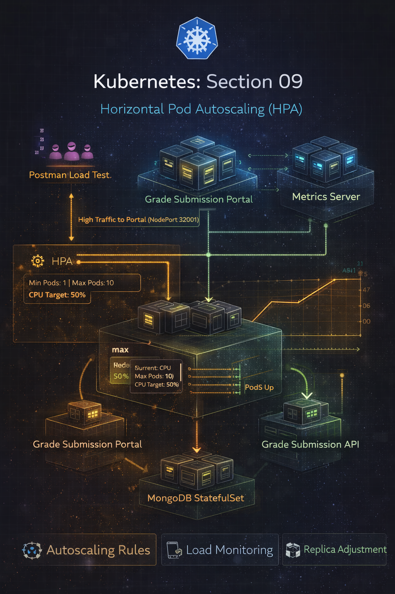

# Repo Layout
```
09-section-nine-HPA
├── grade-submission-api/
│   ├── grade-submission-api-config.yaml
│   ├── grade-submission-api-secret.yaml
│   ├── grade-submission-api-deployment.yaml
│   └── grade-submission-api-service.yaml
│
├── grade-submission-portal/
│   ├── grade-submission-portal-config.yaml
│   ├── grade-submission-portal-deployment.yaml
│   ├── grade-submission-portal-hpa.yaml
│   └── grade-submission-portal-service.yaml
│
├── mongodb/
│   ├── mongodb-secret.yaml
│   ├── mongodb-statefulset.yaml
│   └── mongodb-service.yaml
│
├── Screenshots
│   ├── 1-metric-server-installation.png
│   ├── 2-applied-yaml-files.png
│   ├── 3-grade-submission-portal-form.png
│   ├── 4-grade-submission-portal-grades.png
│   ├── 5-flooded-requests-on-portal.png
│   ├── 6-kubectl-hpa-result.png
│   ├── 7-hpa-successful.png
│   ├── 8-hpa-scaled-down.png
│   └── 9-section-nine.png
│
└── README.md

```


# Section 09 - Horizontal Pod Autoscaling (HPA)

## Overview

In this section, I enabled Horizontal Pod Autoscaling (HPA) for the `grade-submission-portal` application using CPU-based metrics provided by the Kubernetes Metrics Server.
I validated autoscaling behavior by generating load using Postman and observed automatic scale-up and scale-down of pods in real time.

---

## Application Architecture
```
User / Postman Load
        |
        v
 NodePort Service (32001)
        |
        v
Grade Submission Portal (Deployment + HPA)
        |
        v
Grade Submission API (Deployment)
        |
        v
MongoDB (StatefulSet + PVC)
```
Key Points

- HPA is applied only to the frontend (portal).

- API and MongoDB remain stable to isolate scaling behavior.

- Metrics Server feeds CPU metrics to the HPA control loop.



### 🛠️ Prerequisites
- Kubernetes cluster running on Docker Desktop (Windows)

- `kubectl` configured

- Previous sections’ manifests (ConfigMaps, Secrets, Deployments, StatefulSet)

## 📦 Step 1: Installing Metrics Server

Metrics Server is required for HPA to fetch CPU metrics.

```
kubectl apply -f https://github.com/kubernetes-sigs/metrics-server/releases/latest/download/components.yaml
```
Since this is a local Docker Desktop cluster, kubelet TLS verification was disabled:
```
kubectl patch deployment metrics-server -n kube-system \
--type='json' \
-p='[{"op":"add","path":"/spec/template/spec/containers/0/args/-","value":"--kubelet-insecure-tls"}]'

```


## 📊 Step 2: HPA Configuration

grade-submission-portal-hpa.yaml
```
apiVersion: autoscaling/v2
kind: HorizontalPodAutoscaler
metadata:
  name: grade-submission-portal-hpa
  namespace: grade-submission
spec:
  scaleTargetRef:
    apiVersion: apps/v1
    kind: Deployment
    name: grade-submission-portal
  minReplicas: 1
  maxReplicas: 10
  metrics:
  - type: Resource
    resource:
      name: cpu
      target:
        type: Utilization
        averageUtilization: 50
```
What this means
- Kubernetes tries to keep CPU usage at ~50%

- Pods scale between 1 and 10

- Scaling decisions are fully automatic

## 🚀 Step 3: Deploying the Application Stack
```
kubectl apply -f grade-submission-portal
kubectl apply -f grade-submission-api
kubectl apply -f mongodb
```


All resources applied successfully.

Verifying Portal Reachability


## ✅ Step 4: Baseline Verification
```
kubectl top pods -n grade-submission
kubectl get hpa -n grade-submission
```

At rest:

- CPU usage is low

- Portal runs with 1 replica

- HPA target not breached


## 🔥 Step 5: Load Testing with Postman

- Created a Postman Runner

- 20 virtual users

- 10 minutes duration

- Requests sent continuously to the portal


## 📈 Step 6: Observing Autoscaling in Action
During load:
```
kubectl get pods -n grade-submission
kubectl get hpa -n grade-submission
```


Observed behavior:

- CPU crossed 50%

- HPA scaled pods from 1 → 4+

- New pods entered `ContainerCreating` → `Running`

## 📉 Step 7: Automatic Scale Down

After stopping Postman:

- CPU dropped

- HPA reduced replicas automatically

- Cluster returned to steady state


## ⚙️ Behind the Scenes

How HPA Actually Works

1. Metrics Collection

- Metrics Server scrapes CPU usage from kubelets

2. HPA Control Loop

- Periodically checks:

```
  current CPU % vs target CPU %
```
3. Replica Calculation
```
  desiredReplicas = currentReplicas × (currentCPU / targetCPU)
```
4. Scaling Action

- Kubernetes updates the Deployment

- ReplicaSet creates or removes pods

- No manual intervention required

5. Stabalization: 

- Prevents aggressive scaling oscillations

- Gradual scale-down after traffic stops

## 🧠 Key Takeaways

- HPA enables elastic scaling based on real usage

- Metrics Server is mandatory for CPU/memory autoscaling

- Scaling is namespace-scoped

- Frontend scaling protects backend stability

- Kubernetes acts as a closed-loop control system
