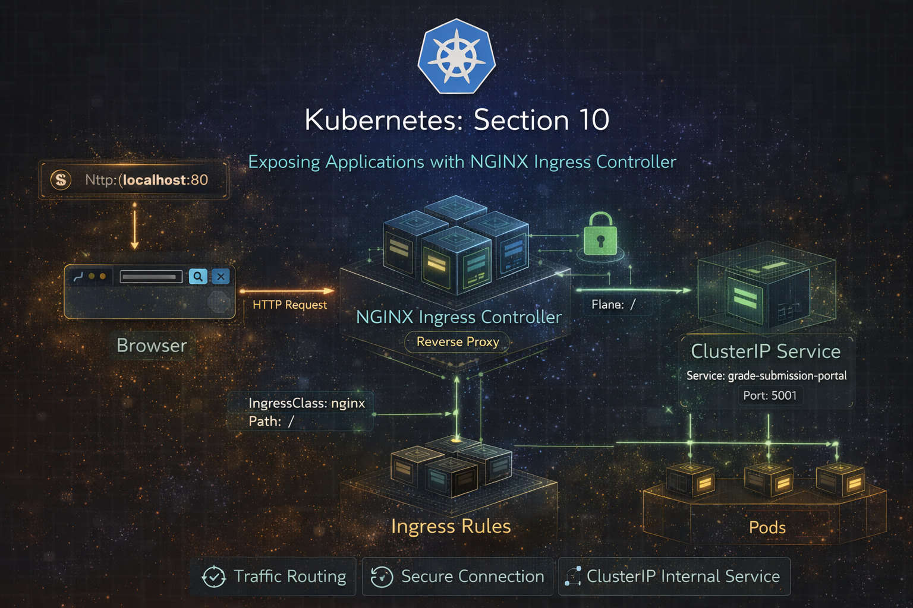
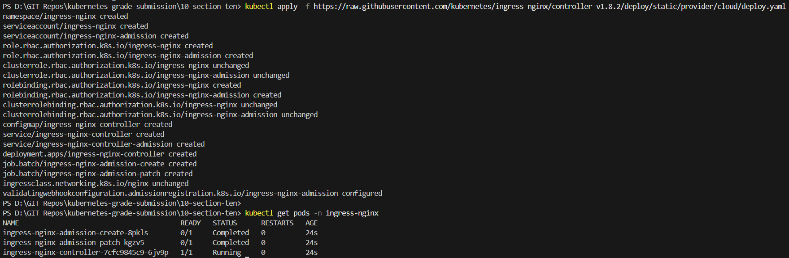
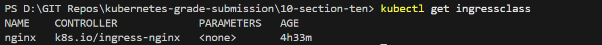
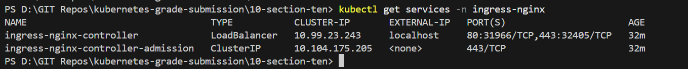
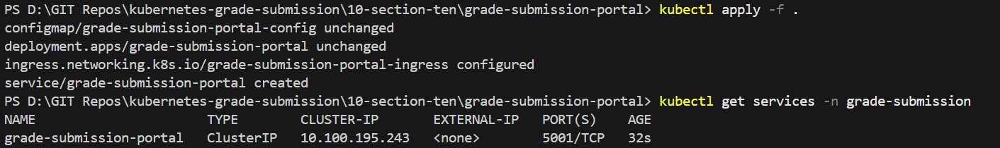
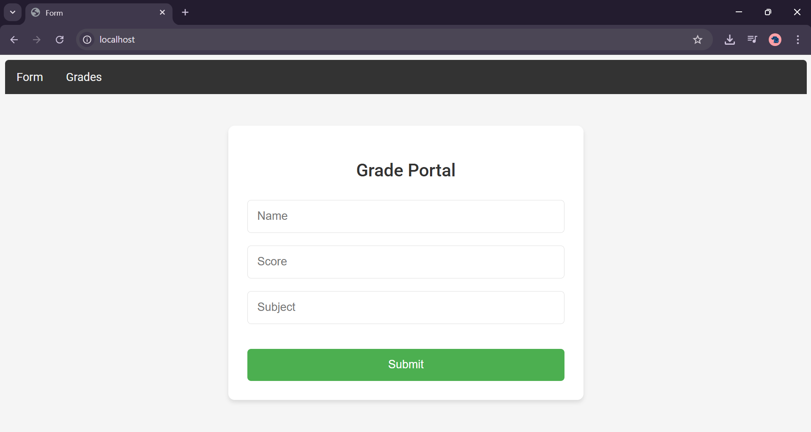

# Repo Layout
```
10-section-ten-ingress-controller
├── grade-submission-api/
│   ├── grade-submission-api-config.yaml
│   ├── grade-submission-api-secret.yaml
│   ├── grade-submission-api-deployment.yaml
│   └── grade-submission-api-service.yaml
│
├── grade-submission-portal/
│   ├── grade-submission-portal-config.yaml
│   ├── grade-submission-portal-deployment.yaml
│   ├── grade-submission-portal-ingress.yaml
│   └── grade-submission-portal-service.yaml
│
├── mongodb/
│   ├── mongodb-secret.yaml
│   ├── mongodb-statefulset.yaml
│   └── mongodb-service.yaml
│
├── Screenshots
│   ├── 1-nginx-ingress-controller-installation.png
│   ├── 2-ingressclass.png
│   ├── 3-kubectl-apply-all.png
│   ├── 4-ingress-service.png
│   ├── 5-localhost.png
│   └── 6-section-ten.png
│
└── README.md

```
# Section 10 - Ingress Controller

## Overview

In this section, I exposed the Grade Submission Portal using an NGINX Ingress Controller, replacing NodePort access with a clean, production-style HTTP entry point.

---

## Application Architecture
This section explains how traffic flows end-to-end after introducing Ingress.
```
Browser (http://localhost)
        |
        v
NGINX Ingress Controller (ingress-nginx namespace)
        |
        v
Ingress Resource (grade-submission namespace)
        |
        v
ClusterIP Service (grade-submission-portal)
        |
        v
Portal Pods (Deployment)

```



### 🔧 Components Introduced

| Component                | Purpose                                   |
| ------------------------ | ----------------------------------------- |
| NGINX Ingress Controller | Acts as reverse proxy for HTTP traffic    |
| IngressClass (nginx)     | Binds Ingress resources to the controller |
| Ingress Resource         | Defines routing rules                     |
| ClusterIP Service        | Internal service for backend pods         |


### ⚙️ Step-by-Step Implementation

### 1️⃣ Install and Verify NGINX Ingress Controller

```
kubectl apply -f https://raw.githubusercontent.com/kubernetes/ingress-nginx/controller-v1.8.2/deploy/static/provider/cloud/deploy.yaml

```
```
kubectl get pods -n ingress-nginx
```



### 2️⃣ Verify Ingress Class

```
kubectl get ingressclass
```


### 3️⃣ Convert Portal Service to ClusterIP
Why?
Ingress routes traffic to services, not directly to pods. NodePort is no longer required.
```
kind: Service
spec:
  type: ClusterIP
```


### 4️⃣ Create Ingress Resource
```
apiVersion: networking.k8s.io/v1
kind: Ingress
metadata:
  name: grade-submission-portal-ingress
  namespace: grade-submission
spec:
  ingressClassName: nginx
  rules:
  - http:
      paths:
      - path: /
        pathType: Prefix
        backend:
          service:
            name: grade-submission-portal
            port:
              number: 5001
```



### 5️⃣ Access Application via Ingress



## 🔍 Behind the Scenes

Why Ingress Is a Reverse Proxy

- Clients never talk directly to pods or services

- Ingress controller terminates HTTP

- Routing decisions are made before traffic enters the cluster

Request Lifecycle

1. Browser sends HTTP request to localhost:80

2. Docker Desktop maps traffic to Ingress Controller

3. Controller inspects Ingress rules

4. Matches / path

5. Forwards traffic to ClusterIP service

6. Service load-balances across pods

## 🔐 Why This Is Better Than NodePort

| NodePort                  | Ingress                      |
| ------------------------- | ---------------------------- |
| Exposes random high ports | Uses standard HTTP/HTTPS     |
| One service = one port    | Multiple services, one entry |
| Not production-friendly   | Production-grade routing     |
| No TLS handling           | TLS & host-based routing     |

## 🌍 Production Considerations

In production, routing becomes host-based:
```
rules:
- host: grades.myuniversity.com
```
This enables:

- Domain-based routing

- TLS termination

- Multi-service ingress

### ✅ Key Takeaways
- Ingress controllers act as reverse proxies

- Services remain internal (ClusterIP)

- Routing logic is declarative

- This mirrors real-world Kubernetes deployments

