# Repo Layout
```
11-HELM (API+Portal)
├── grade-submission-api/
│   │── templates/
│   │   ├── grade-submission-api-config.yaml
│   │   ├── grade-submission-api-deployment.yaml
│   │   ├── grade-submission-api-secret.yaml
│   │   └── grade-submission-api-service.yaml
│   │── Chart.yaml
│   │── grade-submission-api-1.0.0.tgz
│   └── values.yaml 
│
├── grade-submission-portal/
│   │── templates/
│   │   ├── grade-submission-portal-config.yaml
│   │   ├── grade-submission-portal-deployment.yaml
│   │   ├── grade-submission-portal-secret.yaml
│   │   └── grade-submission-portal-service.yaml
│   │── Chart.yaml
│   │── grade-submission-portal-1.0.0.tgz
│   └── values.yaml
│
├── mongodb/
│   │── mongodb-secret.yaml
│   │── mongodb-service.yaml
│   └── mongodb-statefulset.yaml
│
├── Screenshots/
│   │── 1-HELM-installation.png
│   │── 2-HELM-version.png
│   │── 3-clean-up.png
│   │── 4-reapply-mongodb.png
│   │── 5-helm-package-creation-api.png
│   │── 6-helm-package-installation-api.png
│   │── 7-get-pods.png
│   │── 8-get-configmap.png
│   │── 9-get-secrets.png
│   │── 10-helm-package-uninstallation.png
│   │── 11-helm-package-creation-portal.png
│   │── 12-helm-package-installation-portal.png
│   │── 13-final-deployments.png
│   │── 14-form.png
│   └── 15-grades.png
│
└── README.md

```
# 🚀 Section 11 – Helm: Packaging the Grade Submission Application

## Overview

This section transitions the project from raw Kubernetes manifests to a Helm-based deployment model, enabling repeatable, parameterized, and clean release management.

We convert both:

- GRADE-SUBMISSION-API (Backend)
- GRADE-SUBMISSION-PORTAL (Frontend)

into production-ready Helm charts.

---

## 🏗️ Helm Workflow Architecture

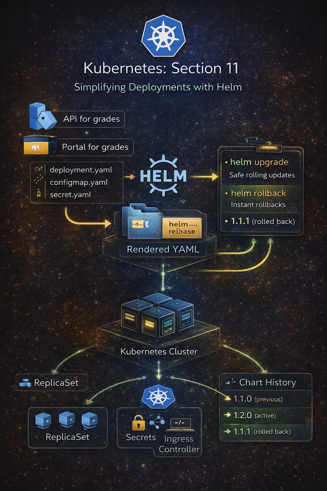

## 📦 Why Helm?

Before Helm, we were manually applying:

- Deployments
- Services
- ConfigMaps
- Secrets
- Ingress

This approach works — but:

- It’s repetitive
- Hard to version
- Risky during cleanup
- Difficult to parameterize

Helm solves this by:
- Packaging everything into a Chart
- Centralizing configuration in `values.yaml`
- Enabling install / upgrade / uninstall with a single command
- Managing releases safely

# 🛠 Part 1 – Helm Installation Using Chocolatey (Windows)

```
choco install kubernetes-helm
```
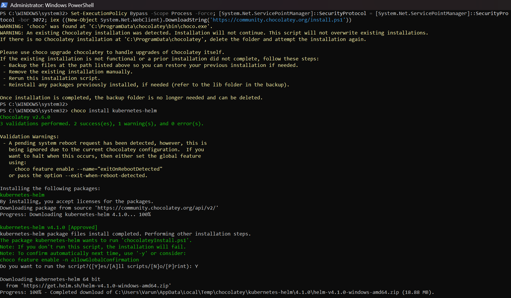

Verifying installation:

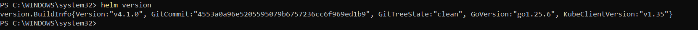

# 🧹 Cleanup Before Helm Migration
To prevent conflicts, remove previously deployed Kubernetes resources:
```
kubectl delete configmap,deployment,secret,service,ingress --all -n grade-submission
```
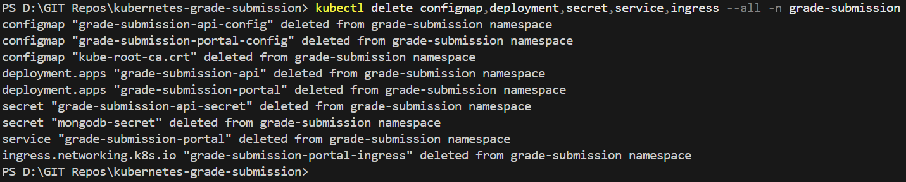

MongoDB was accidentally deleted and re-applied:
```
MongoDB was accidentally deleted and re-applied:
```
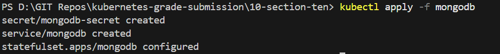


# 🧠 Helm Architecture Overview

Each Helm chart contains: 
```
    grade-submission-api/
    │── templates/
    │   ├── grade-submission-api-config.yaml
    │   ├── grade-submission-api-deployment.yaml
    │   ├── grade-submission-api-secret.yaml
    │   └── grade-submission-api-service.yaml
    │── Chart.yaml
    └── values.yaml 
```

Helm renders templates using:
```
helm template .
```


# 🔵 GRADE-SUBMISSION-API (Backend)

### 1️⃣ Chart.yaml

```
apiVersion: v2
name: grade-submission-api
description: Backend service for managing grade data
version: 1.0.0
```

### 2️⃣ values.yaml
We progressively evolved this file to include:

- Microservice configuration
- Container configuration
- Environment variables
- Secrets

Final structure:
```
microservice:
  name: grade-submission-api
  namespace: grade-submission
  replicas: 2

workload:
  image: rslim087/kubernetes-course-grade-submission-api:stateless-v3
  port: 3000
  resources:
    memory: "128Mi"
    cpu: "128m"
  livenessDelay: 15

env:
  MONGODB_HOST: mongodb
  MONGODB_PORT: "27017"

secrets:
  MONGODB_USER: YWRtaW4=
  MONGODB_PASSWORD: cGFzc3dvcmQxMjM=
```

### 3️⃣ Template Rendering
Render chart locally:
```
helm template .
```
This allows validation before installation.

### 4️⃣ Packaging the API Chart
```
helm package .
```
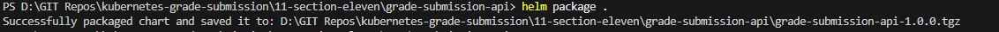

### 5️⃣ Installing the API Release
```
helm install grade-submission-api grade-submission-api-1.0.0.tgz
```
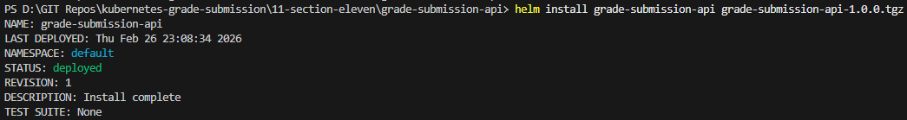

### 6️⃣ Verification
```
kubectl get pods -n grade-submission
```
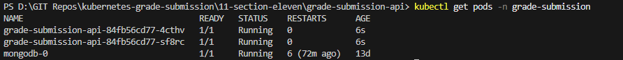
```
kubectl get configmap -n grade-submission
```
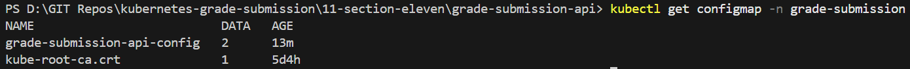
```
kubectl get secrets -n grade-submission
```
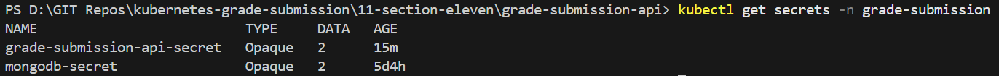

### 7️⃣ Uninstalling (Clean Removal if required)

```
helm uninstall grade-submission-api
```
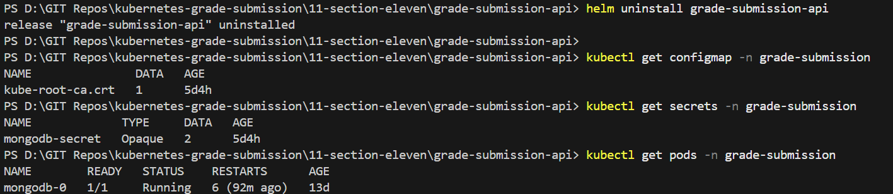

Helm removes:
- Deployment
- Service
- ConfigMap
- Secret
- Labels

No manual cleanup needed.

# 🟢 GRADE-SUBMISSION-PORTAL (Frontend)

The same Helm process was applied to the frontend.

### 1️⃣ values.yaml
```
microservice:
  name: grade-submission-portal
  namespace: grade-submission
  replicas: 1

workload:
  image: rslim087/kubernetes-course-grade-submission-portal
  port: 5001
  resources:
    memory: "128Mi"
    cpu: "128m"
  livenessDelay: 15

env:
  GRADE_SERVICE_HOST: grade-submission-api
```
### 2️⃣ Ingress Template
```
apiVersion: networking.k8s.io/v1
kind: Ingress
metadata:
  name: "{{ .Values.microservice.name }}-ingress"
spec:
  ingressClassName: nginx
```

Ingress allows access via:
```
http://localhost
```
### 3️⃣ Template Validation
```
helm template .
```

### 4️⃣ Packaging Portal Chart
```
helm package .
```
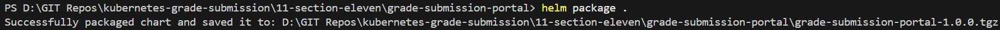


### 5️⃣ Installing Portal Release
```
helm install grade-submission-portal grade-submission-portal-1.0.0.tgz
```
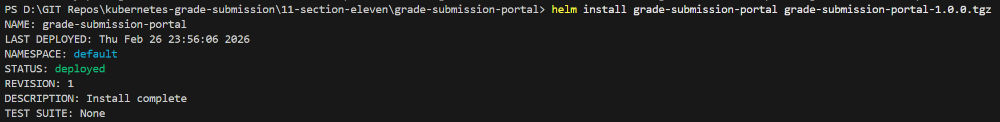


### 6️⃣ Deployment Verification
```
kubectl get deployments -n grade-submission
```

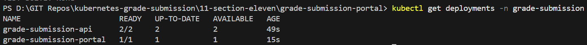

# 🌐 UI Validation

After installation:

Visit:
```
http://localhost
```
Portal loads successfully.

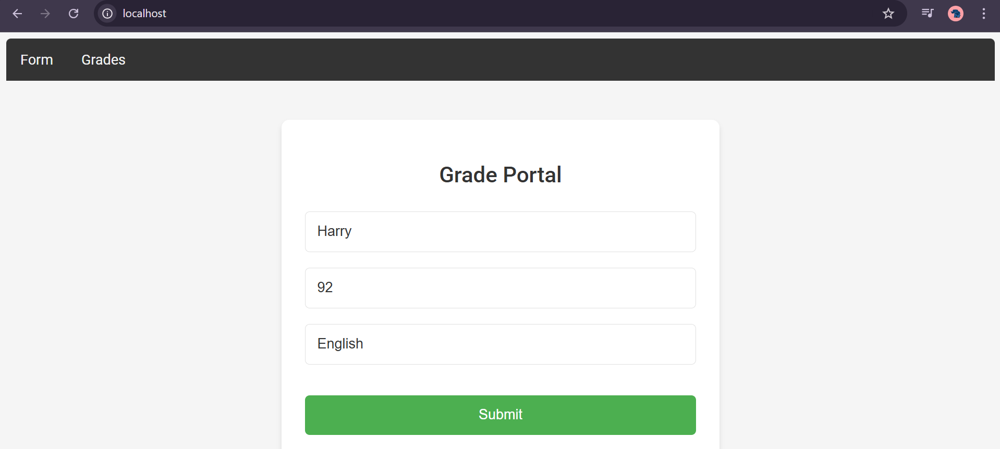

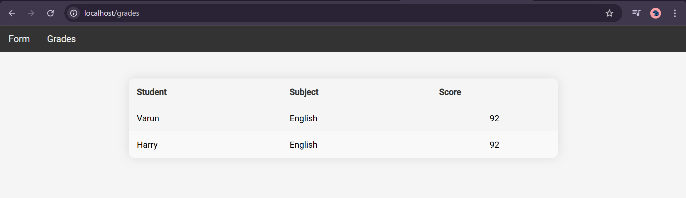


# 🔍 Behind the Scenes – What Helm Is Really Doing

When you run: 
```
helm install grade-submission-api ...
```
Helm:

- Renders templates using values.yaml
- Creates Kubernetes manifests
- Labels them with release metadata
- Stores release state in Kubernetes
- Enables version-controlled upgrades


When you run:
```
helm uninstall grade-submission-api
```

Helm:

- Tracks all created resources
- Deletes them safely
- Prevents accidental removal of unrelated objects

# 📊 What We Achieved in Section 11
```
| Feature          | Before Helm | After Helm       |
| ---------------- | ----------- | ---------------- |
| Deployment       | Manual      | Packaged         |
| Cleanup          | Risky       | One command      |
| Versioning       | None        | Chart versioning |
| Parameterization | Hardcoded   | values.yaml      |
| Reusability      | Low         | High             |
| Release Tracking | None        | Helm Release     |
```
# 🏁 Final Architecture After Helm
```
Ingress
   ↓
Portal (Helm Release)
   ↓
API (Helm Release)
   ↓
MongoDB (StatefulSet)
```
Two independent Helm releases:

- grade-submission-api
- grade-submission-portal

# 🧠 Key Concepts Learned in Section 11

Helm acts as a package manager for Kubernetes, allowing multiple Kubernetes resources to be bundled and managed as a single release.

Instead of managing individual YAML files (Deployment, Service, ConfigMap, Secret, Ingress), Helm groups them into a Chart, enabling:

- Centralized configuration
- Versioned deployments
- Simplified upgrades and rollbacks
- Clean uninstall of all related resources
- Release tracking

This significantly improves operational control compared to applying loose manifests.

# 📂 Helm Chart Structure
Each service was converted into the following structure:

```
📂 Helm Chart Structure

  grade-submission-api/
  ├── Chart.yaml
  ├── values.yaml
  └── templates/
```

Chart.yaml

Contains metadata such as chart name and version.

values.yaml

Holds default configuration values (replicas, image, ports, environment variables, secrets).

templates/

Contains Kubernetes manifest templates using Helm templating syntax.

### ⚙️ Common Helm Commands Used

Install a release:
```
helm install grade-submission-api grade-submission-api-1.0.0.tgz
```
Uninstall a release:
```
helm uninstall grade-submission-api
```
Upgrade a release:
```
helm upgrade grade-submission-api .
```
Render templates locally:
```
helm template .
```
Package a chart: 
```
helm package .
```

# 🎯 Section 11 Summary

This section transforms the project from:

“YAML-based Kubernetes deployment”

into:

“Versioned, parameterized, production-style Helm-managed releases”

Helm now manages:

- Installations
- Rollbacks
- Upgrades
- Clean uninstalls
- Release history

This is how real-world Kubernetes environments operate.

