# Repo Layout
```
12-HELM (API+Portal)
├── grade-submission-api/
│   │── templates/
│   │   ├── grade-submission-api-deployment.yaml
│   │   ├── grade-submission-api-secret.yaml
│   │   └── grade-submission-api-service.yaml
│   │── Chart.yaml
│   └── values.yaml 
│
├── grade-submission-portal/
│   │── templates/
│   │   ├── grade-submission-portal-config.yaml
│   │   ├── grade-submission-portal-deployment.yaml
│   │   ├── grade-submission-portal-secret.yaml
│   │   └── grade-submission-portal-service.yaml
│   │── Chart.yaml
│   │── grade-submission-portal-1.0.0.tgz
│   └── values.yaml
│
├── mongodb/
│   │── mongodb-secret.yaml
│   │── mongodb-service.yaml
│   └── mongodb-statefulset.yaml
│
├── Screenshots/
│   │── 1-helm-list-A.png
│   │── 2-pods-and-deployments.png
│   │── 3-uninstallation.png
│   │── 4-repackaging-reinstallation-verification.png
│   │── 5-helm-upgrade-grade-submission-api.png
│   │── 6-helm-upgrade-1.0.0.3-grade-submission-api.png
│   │── 7-rollback.png
│   │── 8-get-pods-error.png
│   │── 9-helm-upgrade-1.0.0.4-grade-submission-api.png
│   └── 10-section-twelve
│
└── README.md

```
# 🚀 Section 12 – Helm Upgrades, Namespaces & Rollbacks

## Overview

In this section, I moved Helm releases into the correct namespace, upgraded chart versions, performed rollbacks, and debugged a real production-style failure.

## 🔁 Helm Release Lifecycle Workflow

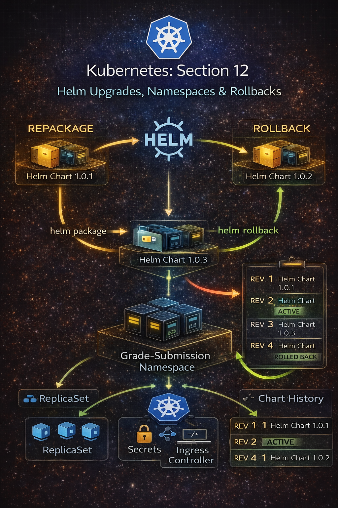


Helm Chart → Upgrade → Revision → Rollback → Namespace-scoped Resources


## 🏗️ Release Scope vs Resource Namespace

### 📌 Observation

When running:
```
helm list -A
```
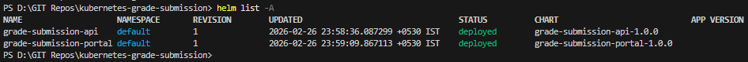

You’ll see releases initially deployed in the default namespace.

However, application resources were created inside:

```
kubectl get pods -n grade-submission
kubectl get deployments -n grade-submission
```

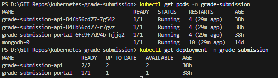


### 🧠 Behind the Scenes

Helm release namespace and resource namespace are not automatically the same.

If you don’t specify -n, Helm installs the release in the default namespace, even if templates deploy resources elsewhere.

Best practice:

Keep release + resources in the same namespace.


## 🧹 Cleaning Up Incorrect Releases
```
helm uninstall grade-submission-api
helm uninstall grade-submission-portal
```
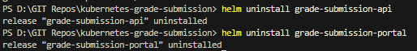


## 📦 Repackage and Install in Correct Namespace
```
helm package .
helm install grade-submission-api grade-submission-api-1.0.1.tgz -n grade-submission
```
Repeat for portal.
```
helm package .
helm install grade-submission-portal grade-submission-portal-1.0.0.tgz -n grade-submission
```

```
helm list -A
```
Everything correctly scoped to `grade-submission`.

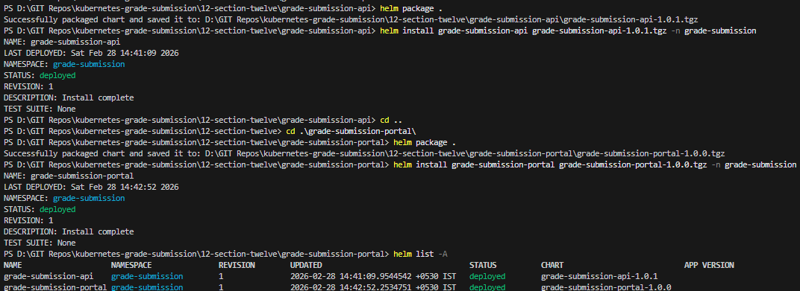


# 🔄 Version Upgrades (Chart 1.0.2)

Updated:

- Image → stateless-v4
- Replaced env + configmap with 1MONGODB_URI`
- Used `stringData` in Secret
- Bumped Chart version → 1.0.2

Then: 

```
helm package .
helm upgrade grade-submission-api grade-submission-api-1.0.2.tgz -n grade-submission
```
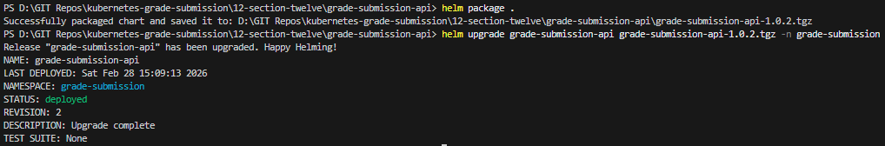

# ⚡ Direct Upgrade Without Packaging (1.0.3)

Instead of packaging manually:

```
helm upgrade grade-submission-api . -n grade-submission
```
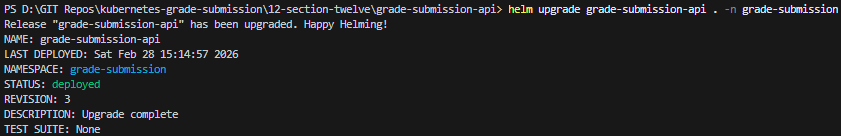

# 🧠 Behind the Scenes — Upgrade Flow

When running:

```
helm upgrade RELEASE .
```
Helm:

1. Reads Chart.yaml (new version)
2. Renders templates with values.yaml
3. Compares against existing release
4. Creates a new revision
5. Applies only necessary changes

Each upgrade increments a revision number.


# 🔙 Rollback Scenario

Assume version 1.0.3 fails.

```
helm rollback grade-submission-api 2 -n grade-submission
```
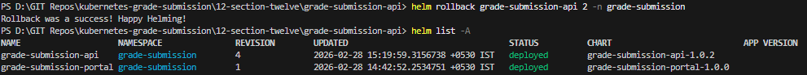

Helm restores previous revision state.


# ❌ Real Failure Scenario

After rollback, pods showed:

```
CreateContainerConfigError
```
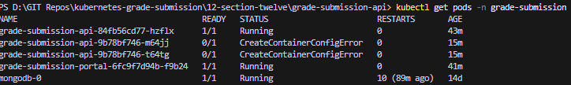

## 🧠 Root Cause

Deployment still referenced ConfigMap in envFrom, but ConfigMap had been removed earlier.

This caused container startup failure.

## 🛠 Fix Applied

Updated deployment:

Removed ConfigMap reference:

```
envFrom:
  - secretRef:
      name: "{{ .Values.microservice.name }}-secret"
```

Bumped chart version → 1.0.4

```
helm upgrade grade-submission-api . -n grade-submission
```
Pods running successfully again.

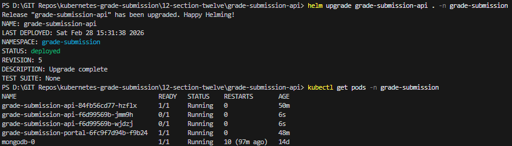

# Deployment Workflow

Helm deployment lifecycle:

1. Modify chart files

2. Preview using `helm template`

3. Upgrade using `helm upgrade`

4. Monitor via `kubectl`

5. Rollback if needed

6. Uninstall cleanly when required


# 📌 Key Takeaways

- Helm release namespace matters
- Chart versioning controls upgrade flow
- Every upgrade creates a new revision
- Rollback restores previous release state
- Removing referenced resources causes container config errors
- Always validate after upgrade


# 🏆 Why This Section Matters

This was the shift from:

Basic Helm usage → to → Real-world release management with upgrade & rollback strategy

This is how production-grade Kubernetes systems are maintained.


---

# Section 12 – Extending with Helm Package Manager (MongoDB Deployment)
Overview

Until this point, MongoDB was manually deployed using Kubernetes resources such as StatefulSets, Services, Secrets, and Persistent Volumes.

In this extension of Section 12, the deployment is improved by using Helm, the package manager for Kubernetes. Helm allows complex applications to be deployed using predefined charts, reducing the need to manually manage multiple Kubernetes manifests.

The MongoDB instance is now deployed using the Bitnami MongoDB Helm Chart, making the deployment more modular, maintainable, and production-like.

# Updated Repo Layout
```
12-HELM (API+Portal)
├── grade-submission-api/
│   │── templates/
│   │   ├── grade-submission-api-deployment.yaml
│   │   ├── grade-submission-api-secret.yaml
│   │   └── grade-submission-api-service.yaml
│   │── Chart.yaml
│   └── values.yaml 
│
├── grade-submission-portal/
│   │── templates/
│   │   ├── grade-submission-portal-config.yaml
│   │   ├── grade-submission-portal-deployment.yaml
│   │   ├── grade-submission-portal-ingress.yaml
│   │   └── grade-submission-portal-service.yaml
│   │── Chart.yaml
│   └── values.yaml
│
├── mongodb/
│   │── default_values.yaml
│   └── values.yaml
│
├── Screenshots/
│   │── 1-helm-list-A.png
│   │── 2-pods-and-deployments.png
│   │── 3-uninstallation.png
│   │── 4-repackaging-reinstallation-verification.png
│   │── 5-helm-upgrade-grade-submission-api.png
│   │── 6-helm-upgrade-1.0.0.3-grade-submission-api.png
│   │── 7-rollback.png
│   │── 8-get-pods-error.png
│   │── 9-helm-upgrade-1.0.0.4-grade-submission-api.png
│   │── 10-section-twelve
│   │── 11-cleanup
│   │── 12-mongo-pods-verification
│   │── 13-deploying-helm
│   │── 14-frontend
│   │── 15-helm-releases
│   │── 16-bitnami-repo-add-update
│   │── 16-section-12-part-2
│   │── 17-repo-search
│   │── 18-mongo-helm-deploy
│   │── 19-mongo-helm-verify
│   │── 20-mongo-helm-uninstall-and-reinstall
│   │── 21-mongo-pod
│   │── 22-api-reinstall
│   │── 23-verify-pods
│   │── 24-form
│   └──  24-form
│
└── README.md
```
# Workflow

### 1. Environment Cleanup

Before starting the Helm-based deployment, all previously created Kubernetes resources were removed to ensure a clean cluster state.

```
kubectl delete configmap,secret,service,deployment,hpa,statefulset,pv,pvc,pod -n grade-submission --all
```

Verification:
```
helm list -A
kubectl get pods -n grade-submission
```

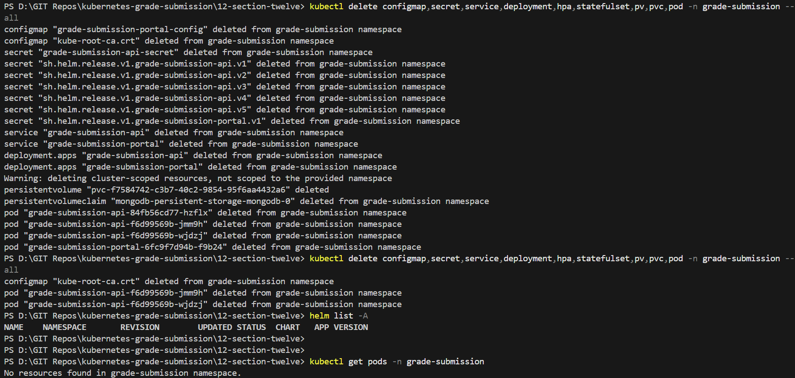

MongoDB namespace verification:
```
kubectl get pods -n mongodb
kubectl get all -n mongodb
```
At this stage, no resources exist in the cluster.

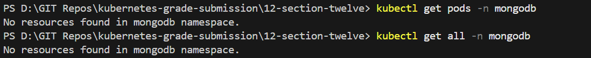

### 2. Deploying Application Helm Charts
The application Helm charts created earlier are now deployed again.

#### Deploy Grade Submission Portal
```
helm install grade-submission-portal . -n grade-submission
```
#### Deploy Grade Submission API
```
helm install grade-submission-api . -n grade-submission
```

Verification:
```
kubectl get pods -n grade-submission
```

Result:
- Portal pod running successfully
- API pods running but not ready

Reason:

The API is trying to connect to MongoDB, which has not yet been deployed.

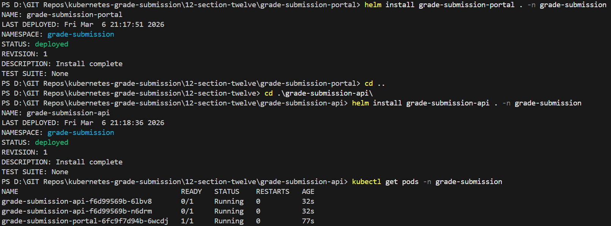

### 3. Verifying the Frontend

Access the portal:
```
http://localhost
```
The Grade Portal UI loads successfully, but backend functionality is not operational since MongoDB is not available.

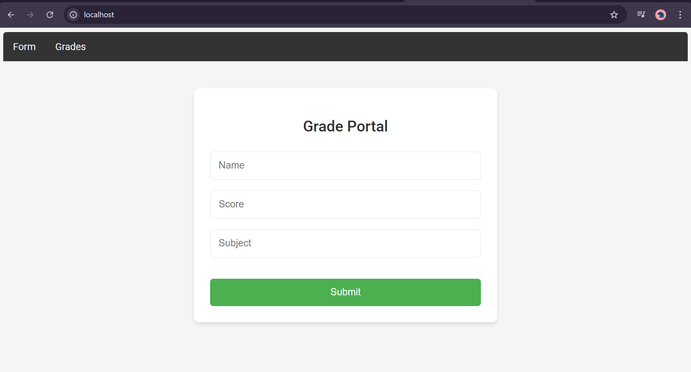

### 4. Verifying Helm Releases
```
helm list -A
```

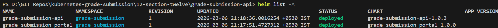

This confirms that the following Helm releases exist:

- grade-submission-api

- grade-submission-portal

Both are deployed in the grade-submission namespace.

### 5. Adding Bitnami Helm Repository
Inside the mongodb directory, the Bitnami Helm repository is added.
```
helm repo add bitnami https://charts.bitnami.com/bitnami
helm repo update
```
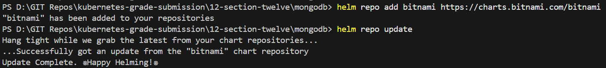

This repository contains Helm charts for many widely used software packages such as:

- MongoDB

- MySQL

- Redis

- Elasticsearch

- PostgreSQL

- Prometheus

### 6. Exploring Available Helm Charts

List available charts:
```
helm search repo
```
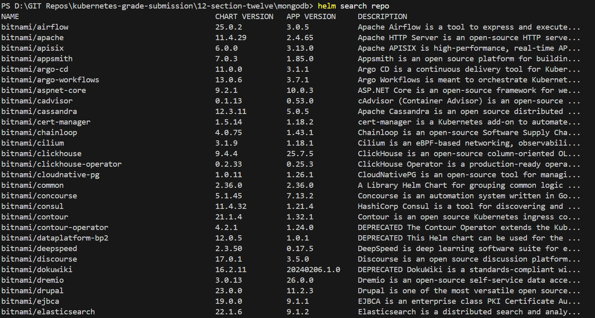


Search specifically for MongoDB charts:
```
helm search repo bitnami/mongodb --versions
```
This displays all available versions of the MongoDB Helm chart.

### 7. Inspecting Default Chart Values
To understand the configurable parameters of the MongoDB Helm chart:
```
helm show values bitnami/mongodb > default_values.yaml
```
This creates a default_values.yaml file containing all default configuration options.

### 8. Creating Custom values.yaml

A new values.yaml file is created to override specific settings.

Previous MongoDB YAML files are removed since Helm now manages deployment.

Removed files:

- mongodb-secret.yaml

- mongodb-service.yaml

- mongodb-statefulset.yaml

Initial configuration:
```
useStatefulSet: true

auth:
  enabled: true
  ```

### 9. Deploying MongoDB Helm Chart
MongoDB is installed using the specified Helm chart version.
```
helm install mongodb bitnami/mongodb \
--version 15.6.13 \
-f values.yaml \
-n mongodb \
--create-namespace
```

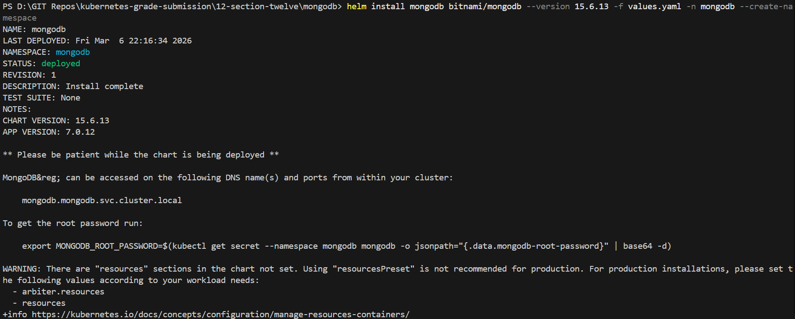

Verfication:
```
kubectl get pods -n mongodb
kubectl get statefulset -n mongodb
```

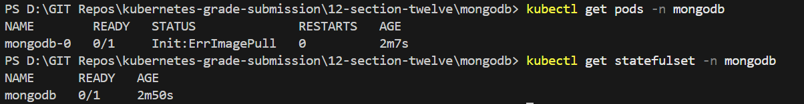

### 10. Troubleshooting Image Pull Error
The MongoDB pod initially failed with the status:
```
Init:ErrImagePull
```
Root Cause: 

The default Bitnami MongoDB image had architecture compatibility issues.

Solution:

Override the container image in values.yaml.

Updated configuration:

```
useStatefulSet: true

auth:
  enabled: true

image:
  registry: docker.io
  repository: mongo
  tag: 6.0.4-jammy

persistence:
  mountPath: /data/db
```

Reinstall MongoDB:

```
helm uninstall mongodb -n mongodb
```
```
helm install mongodb bitnami/mongodb \
--version 15.6.13 \
-f values.yaml \
-n mongodb
```

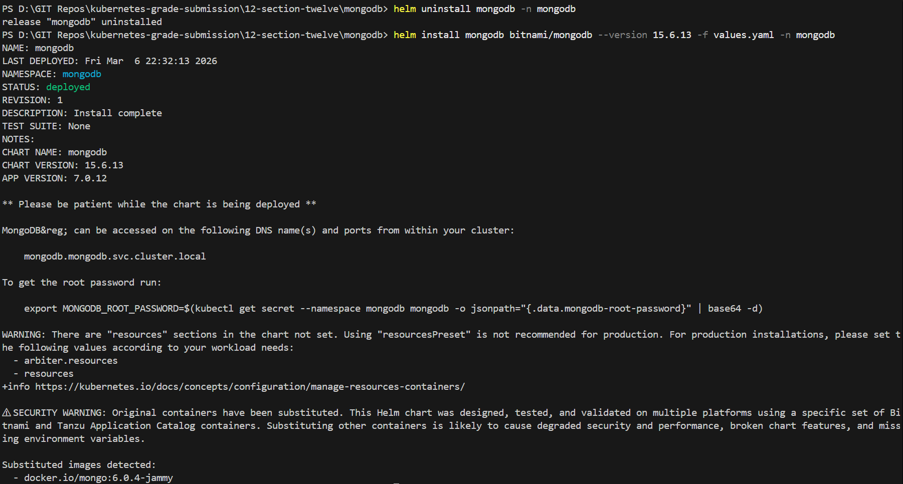

Verification: 
```
kubectl get pods -n mongodb
```

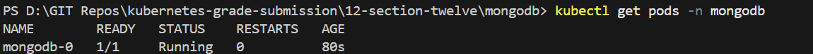

Result: 
```
mongodb-0   1/1 Running
```
MongoDB is now successfully deployed.

### 11. Cross-Namespace Communication

MongoDB runs in the mongodb namespace, while the application runs in grade-submission namespace.

To enable communication, the API must reference MongoDB using the full service DNS name.

MongoDB Service:

```
kubectl get services -n mongodb
```
Service DNS format:
```
service-name.namespace.svc.cluster.local
```
MongoDB connection string:
```
mongodb.mongodb.svc.cluster.local:27017
```

### 12. Updating API Configuration

Update the values.yaml file inside the `grade-submission-api` Helm chart.
```
secrets:
  MONGODB_URI: 'mongodb://mongodb.mongodb.svc.cluster.local:27017/'
```

### 13. Redeploy API Helm Release

Reinstall the API release so the new configuration takes effect

```
helm uninstall grade-submission-api -n grade-submission

helm install grade-submission-api . -n grade-submission
```

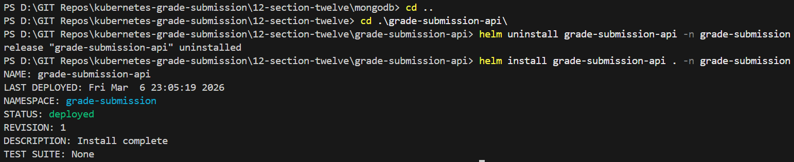

Verification:
```
kubectl get pods -n grade-submission
```

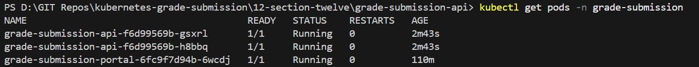

All pods should now be running successfully.

### 14. Final Application Verification

Access the portal again:
```
http://localhost
```
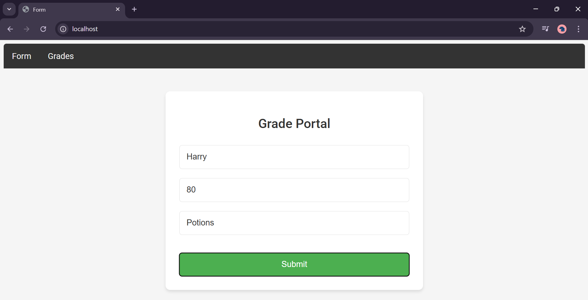

Submit a new grade entry.

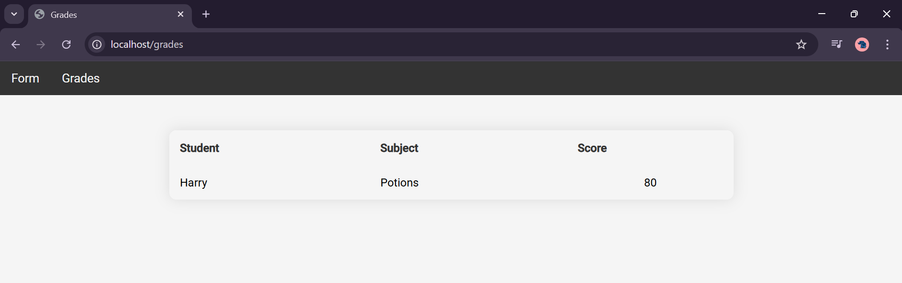

Result:

The application successfully stores and retrieves data from MongoDB deployed via Helm.


# Architecture After Helm Deployment

Application workflow:

```
Browser
   ↓
NGINX Ingress
   ↓
Grade Submission Portal
   ↓
Grade Submission API
   ↓
MongoDB (Helm Chart)
```

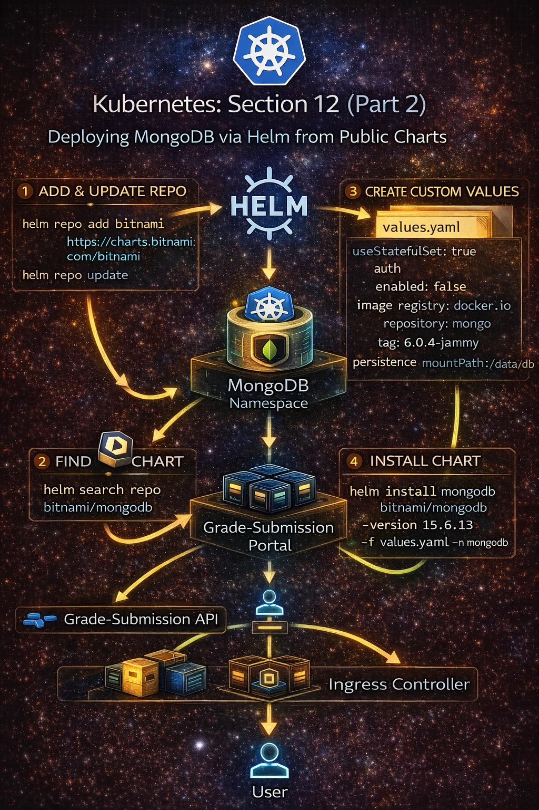

# Key Takeaways

Helm significantly simplifies Kubernetes deployments by allowing complex software to be managed as a single packaged release.

Helm Workflow

1. Add Helm repository

```
helm repo add bitnami https://charts.bitnami.com/bitnami
```

2. Update repositories
```
helm repo update
```
3. Search available charts
```
helm search repo bitnami/mongodb
```
4. Inspect default chart values
```
helm show values bitnami/mongodb
```
5. Override required settings using a custom `values.yaml`

6. Install the chart

```
helm install mongodb bitnami/mongodb -f values.yaml
```

# Conclusion

Using Helm transforms complex Kubernetes deployments into a manageable and reproducible workflow.

Instead of manually configuring multiple Kubernetes resources, Helm allows entire applications to be deployed using versioned charts and customizable values, making infrastructure easier to maintain and scale.